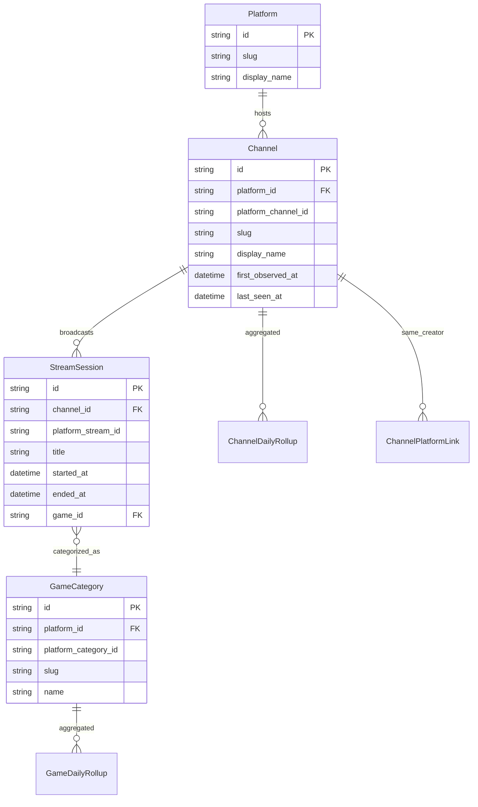

# Domain model

## Entity relationship (conceptual)



## Entities

### Platform

Fixed enum for MVP: `twitch`, `kick`, `youtube`.

| Field | Description |
|-------|-------------|
| `slug` | URL segment |
| `display_name` | “Twitch”, “Kick”, “YouTube Gaming” |

### Channel

A broadcaster identity on one platform.

| Field | Description |
|-------|-------------|
| `platform_channel_id` | Opaque ID from platform API |
| `slug` | URL-safe login or custom slug (unique per platform) |
| `display_name` | Current display name |
| `avatar_url` | Cached URL (refresh periodically) |
| `first_observed_at` | First time ingest saw channel live or in directory |
| `last_seen_at` | Last successful sample |
| `is_tracked` | In active ingest set |

**Cross-platform:** Same human on Twitch and Kick = two `Channel` rows. Optional future `Creator` entity links them (manual or heuristic).

### StreamSession

One live broadcast (or VOD-derived session for backfill).

| Field | Description |
|-------|-------------|
| `platform_stream_id` | Platform’s stream/broadcast ID |
| `started_at` / `ended_at` | UTC |
| `title` | Stream title at start |
| `game_id` | FK to GameCategory at start |
| `language` | BCP-47 if available |

### ViewerSample

High-frequency measurement (not exposed raw on MVP UI).

| Field | Description |
|-------|-------------|
| `stream_session_id` | FK |
| `sampled_at` | Timestamp |
| `viewer_count` | Concurrent viewers |

Rollups consume samples; retain raw samples 7–14 days then drop or archive to R2.

### GameCategory

“Game” or category on a platform (e.g. “Just Chatting”, “League of Legends”).

| Field | Description |
|-------|-------------|
| `slug` | OmniCharts canonical slug |
| `platform_category_id` | Twitch `game_id`, etc. |

### ChannelDailyRollup

Precomputed for fast rankings.

| Field | Description |
|-------|-------------|
| `date` | UTC date |
| `hours_watched` | Σ viewers × interval |
| `average_viewers` | Mean concurrent over airtime |
| `peak_viewers` | Max sample |
| `airtime_minutes` | Live minutes |
| `stream_count` | Sessions that day |
| `followers_delta` | If API provides EOD snapshot |

### GameDailyRollup

Same metrics aggregated at category level (sum HW across channels, weighted AV).

### ChannelPlatformLink (future)

| Field | Description |
|-------|-------------|
| `creator_id` | Internal UUID |
| `channel_id` | FK |

---

## Identifiers in URLs

```
/channels/{slug}?platform=twitch|kick|youtube
/games/{slug}?platform=twitch
/overview?platform=twitch
```

**Resolution order:** `(platform, slug)` → `(platform, platform_channel_id)` if slug changed.

---

## Ingest states

| State | Meaning |
|-------|---------|
| `discovered` | Seen in directory/top lists, not yet sampled |
| `tracked` | Active polling |
| `dormant` | No live in 30d; poll less often |
| `retired` | Platform ID dead; keep historical rollups |
