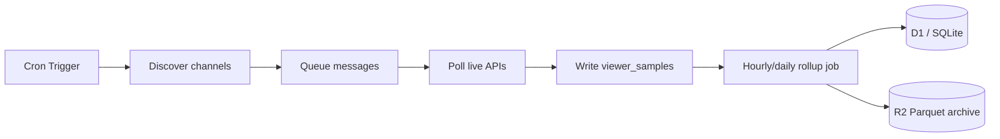

# Ingestion per platform

Strategy **A:** official APIs and permitted public endpoints only. Verify ToS before each production release.

## Historical data reality check

**You cannot download a competitor’s multi-year warehouse.**

| Source | What you get |
|--------|----------------|
| Live polling from launch day forward | Full control; this is the backbone |
| Twitch VOD API (`type=archive`) | Past broadcasts still on Twitch: **7d** default, **14d** Affiliate, **60d** Partner/Prime/Turbo ([VOD help](https://help.twitch.tv/s/article/video-on-demand)) |
| YouTube archived live streams | `concurrentViewers` only while live; no minute curve for past lives via Data API |
| Kick | **No historical concurrent API** — ingest from go-live forward ([ADR-003](./adr/0003-kick-ingest-strategy.md)) |
| Third-party trackers (SullyGnome, etc.) | Their data — do not scrape for production |

**“Full career depth” for OmniCharts means:**

```
career_depth = max(platform_vod_window, now - channel.first_observed_at)
```

As we run longer, `first_observed_at` moves back for channels we track continuously. Optional VOD backfill adds at most one VOD retention window per channel (tier-dependent).

See **Historical backfill** and **MVP tracking caps** sections below.

---

## Architecture summary

| Platform | Lifecycle | Metrics |
|----------|-----------|---------|
| Twitch | EventSub webhook online/offline ([ADR-002](./adr/0002-twitch-eventsub-vs-polling.md)) | Helix `GET /streams` poll, 60s |
| Kick | Optional `livestream.status.updated` webhook | Poll `GET /public/v1/livestreams` (≤50 IDs/batch), 60–120s |
| YouTube | Infer from `videos.list` | Poll `liveStreamingDetails.concurrentViewers`, 120s |

**EventSub does not replace viewer polling** for market analytics.

---

## Twitch

### APIs

| Use | API | Auth |
|-----|-----|------|
| App access token | `POST https://id.twitch.tv/oauth2/token` | `client_id`, `client_secret`, `grant_type=client_credentials` — host is **`id.twitch.tv`**, not `api.twitch.tv` ([OAuth](https://dev.twitch.tv/docs/authentication/getting-tokens-oauth/#client-credentials-grant-flow)) |
| Live streams | `GET https://api.twitch.tv/helix/streams` (≤100 `user_id` per request, repeat param) | App token + **`Client-Id`** header (must match token client) ([Get Streams](https://dev.twitch.tv/docs/api/reference#get-streams)) |
| Channel info | `GET /helix/users`, `GET /helix/channels` | App token |
| Followers count | `GET /helix/channels/followers` (paginated total) | App token |
| Games | `GET /helix/games` | App token |
| Top games | `GET /helix/games/top` | App token |
| VOD backfill | `GET /helix/videos?user_id=&type=archive` | App token |
| EventSub subscribe | `POST https://api.twitch.tv/helix/eventsub/subscriptions` | App token + webhook transport on **HTTPS :443** ([manage subscriptions](https://dev.twitch.tv/docs/eventsub/manage-subscriptions/)) |
| EventSub types | `stream.online`, `stream.offline` | Verify `Twitch-Eventsub-Message-*` + HMAC ([webhook events](https://dev.twitch.tv/docs/eventsub/handling-webhook-events/)) |

Docs: [Twitch Helix](https://dev.twitch.tv/docs/api/)

### Required Helix headers

Every `api.twitch.tv` call:

```http
Authorization: Bearer <app_access_token>
Client-Id: <same client_id used for token>
```

### Example: app token + live streams

```bash
curl -sS -X POST 'https://id.twitch.tv/oauth2/token' \
  -H 'Content-Type: application/x-www-form-urlencoded' \
  -d 'client_id=CLIENT_ID&client_secret=CLIENT_SECRET&grant_type=client_credentials'

curl -sS -G 'https://api.twitch.tv/helix/streams' \
  -H "Authorization: Bearer ${TWITCH_ACCESS_TOKEN}" \
  -H "Client-Id: ${TWITCH_CLIENT_ID}" \
  --data-urlencode 'user_id=123'
```

### Example: EventSub subscription (202 until callback verified)

```bash
curl -sS -X POST 'https://api.twitch.tv/helix/eventsub/subscriptions' \
  -H "Authorization: Bearer ${TWITCH_ACCESS_TOKEN}" \
  -H "Client-Id: ${TWITCH_CLIENT_ID}" \
  -H 'Content-Type: application/json' \
  -d '{
    "type": "stream.online",
    "version": "1",
    "condition": { "broadcaster_user_id": "1234" },
    "transport": {
      "method": "webhook",
      "callback": "https://ingest.example/eventsub",
      "secret": "min-10-char-secret"
    }
  }'
```

### Polling cadence

| Job | Interval | Notes |
|-----|----------|-------|
| Tracked live channels | 60s | Batch up to **100** `user_id` per request |
| Directory expansion | 6h | Top games → discover new channel IDs |
| Follower snapshot | 24h | Store EOD for delta; daily rollup uses **consecutive stored Helix totals** (`GET /channels/followers` `total`), not Twitch calendar-day history — pre-rollup enrichment refreshes `follower_count` for channels with samples that day |
| Dormant channels | 24h | Single stream check |

### Discovery seed

1. Top games → streams live now → new `channel` rows.
2. Minimum threshold for rankings UI: align with industry norm **≥2 average viewers** over period (configurable).

### Rate limits

Default **800 points/min per client ID**; most Helix calls = 1 point. Use `Ratelimit-Remaining` / `Ratelimit-Reset` on 429. Token bucket in ingest Worker; Cloudflare Queues in prod.

`GET /streams` pagination by game can duplicate/omit streams — **dedupe by `user_id`** in discovery.

### VOD backfill job (Phase 4)

- Paginate `videos` with `type=archive`.
- For each VOD, approximate HW from duration × mean viewers if minute data unavailable, OR skip if only metadata.
- Mark `backfill_source = vod` vs `live_sample`.

---

## Kick

Official **Kick Dev Public API** only — no site scraping ([ADR-003](./adr/0003-kick-ingest-strategy.md)). Register at [dev.kick.com](https://dev.kick.com/); accept [Developer ToS](https://dev.kick.com/terms-of-service). Docs: [docs.kick.com](https://docs.kick.com/), [KickDevDocs](https://github.com/KickEngineering/KickDevDocs), OpenAPI: `https://api.kick.com/swagger/doc.yaml`.

**Phase 3 ingest (2026-06):** Tracked-catalog poll + category discovery shipped in `workers/ingest/src/kick/` — `poll_kick_tracked` → `GET /public/v1/livestreams` (≤50 `broadcaster_user_id`/req); `discover_kick` (6h cron) → `GET /public/v2/categories` + category-scoped livestreams (`limit=100`, `sort=viewer_count`). Without `KICK_CLIENT_ID` / `KICK_CLIENT_SECRET`, handlers no-op with `NEEDS_API`. Webhooks remain optional follow-up.

**Research grounding (2026-06-05):** Exa → [docs.kick.com/apis/livestreams](https://docs.kick.com/apis/livestreams), [docs.kick.com/apis/categories](https://docs.kick.com/apis/categories) (`GET /public/v2/categories` cursor pagination), [KickDevDocs livestreams](https://github.com/KickEngineering/KickDevDocs/blob/main/apis/livestreams.md), [KickDevDocs categories](https://github.com/KickEngineering/KickDevDocs/blob/main/apis/categories.md), [OAuth flow](https://github.com/KickEngineering/KickDevDocs/blob/main/getting-started/generating-tokens-oauth2-flow.md). Context7 quota exceeded — no official npm SDK in repo; ingest uses direct `fetch` (Helix-parity). Rate limits still unpublished; default throttle `KICK_REQUESTS_PER_MIN_BUDGET=60` (~1 req/s); **429** → honour `Retry-After` backoff.

**Historical data:** No API for past minute-level concurrent viewers. Ingest from first observation forward only.

### APIs (OmniCharts)

| Use | Endpoint | Auth | Notes |
|-----|----------|------|-------|
| App access token | `POST https://id.kick.com/oauth/token` | `client_credentials` | OAuth host separate from API |
| Live + viewers | `GET /public/v1/livestreams` | Bearer | ≤50 `broadcaster_user_id` per request |
| Platform live count | `GET /public/v1/livestreams/stats` | Bearer | `data.total_count` |
| Channel metadata | `GET /public/v1/channels` | Bearer | `slug` or `broadcaster_user_id` (≤50) |
| Categories (discovery) | `GET /public/v2/categories` | Bearer | Paginated `cursor`; then `GET /public/v1/livestreams?category_id=&sort=viewer_count&limit=100` per category |
| Webhooks | `POST https://api.kick.com/public/v1/events/subscriptions` + URL in [Developer settings](https://kick.com/settings/developer) | App or user token | Lifecycle only — no `viewer_count` ([subscribe](https://docs.kick.com/events/subscribe-to-events)) |

### Authentication

```bash
curl -sS -X POST 'https://id.kick.com/oauth/token' \
  -H 'Content-Type: application/x-www-form-urlencoded' \
  -d 'grant_type=client_credentials' \
  -d 'client_id=YOUR_KICK_CLIENT_ID' \
  -d 'client_secret=YOUR_KICK_CLIENT_SECRET'
```

Store `KICK_CLIENT_ID` / `KICK_CLIENT_SECRET` in ingest Worker secrets. Refresh token on **401** (~3600s lifetime).

### Livestreams polling

```bash
# Repeat broadcaster_user_id up to 50 times per request (OpenAPI: collectionFormat multi)
curl -sS -G 'https://api.kick.com/public/v1/livestreams' \
  -H "Authorization: Bearer ${KICK_ACCESS_TOKEN}" \
  --data-urlencode 'broadcaster_user_id=111' \
  --data-urlencode 'broadcaster_user_id=222' \
  --data-urlencode 'sort=viewer_count'
```

**Hidden `viewer_count`:** treat missing/null/ambiguous `0` while live as unknown — UI “—”; do not fabricate zeros.

### Rate limits

No published RPM. ToS requires reasonable volume. Default **~1 req/s** per app; **429** → backoff + shed dormant tier.

### Webhooks (optional)

`livestream.status.updated` / `livestream.metadata.updated` — session boundaries only ([event types](https://github.com/KickEngineering/KickDevDocs/blob/main/events/event-types.md)).

1. Set webhook URL: [kick.com/settings/developer](https://kick.com/settings/developer).
2. Subscribe:

```bash
curl -sS -X POST 'https://api.kick.com/public/v1/events/subscriptions' \
  -H "Authorization: Bearer ${KICK_ACCESS_TOKEN}" \
  -H 'Content-Type: application/json' \
  -d '{
    "broadcaster_user_id": 123456,
    "method": "webhook",
    "events": [{ "name": "livestream.status.updated", "version": 1 }]
  }'
```

- **App access token:** `broadcaster_user_id` required in body.
- **User token:** needs `events:subscribe`; broadcaster inferred from token.

**Polling remains source of truth for HW/AV.**

### Polling strategy

| Job | Interval | Queue message |
|-----|----------|---------------|
| Tracked live (batches ≤50 IDs) | 60–120s (`*/2 * * * *`) | `poll_kick_tracked` |
| Dormant liveness | 24h | — |
| Category discovery | 6h (`0 */6 * * *`) | `discover_kick` |

Admin: `POST /admin/kick/discover` (optional `{ "quick": true }` — 3 categories). Metadata `kick_discovery_seed_at` in `ingest_metadata`.

See [12-channel-discovery](./12-channel-discovery-and-tracking.md#kick-discovery).

**Not a project blocker** — fallback Twitch + YouTube if access denied at MVP scale.

---

## YouTube (Gaming / Live)

Official: [YouTube Data API v3](https://developers.google.com/youtube/v3) · [Quota](https://developers.google.com/youtube/v3/determine_quota_cost) · [API Services Terms](https://developers.google.com/youtube/terms/api-services-terms-of-service)

### APIs

| Use | API | Cost | Cron? |
|-----|-----|------|-------|
| Handle → channel ID | `channels.list` (`forHandle`) | 1 | On-demand |
| Live viewer count | `videos.list` (`liveStreamingDetails`) | 1 per ≤50 ids | **Yes** |
| Metadata refresh | `channels.list` | 1 | 12–24h |
| Refresh live video id | `playlistItems.list` (uploads, page 1) | 1 | When stale only |
| Bootstrap / admin | `search.list` | **100** | **Never cron** |

**Out of scope:** YouTube Analytics API (owner OAuth), full VOD catalog, Shorts.

### Steady-state pattern

Do **not** cron `search.list`. Track **known `UC…` channel IDs** + **`youtube_live_video_id`** per channel.

```http
GET https://www.googleapis.com/youtube/v3/videos?part=liveStreamingDetails,snippet,statistics&id=VIDEO_ID_1,VIDEO_ID_2&key=API_KEY
```

(`Authorization: Bearer` instead of `key=` is also valid.) `liveBroadcastContent=live` lives on **`snippet`** — requires `part=snippet`. Ref: [videos.list](https://developers.google.com/youtube/v3/docs/videos/list).

**Handle → channel ID:**

```http
GET https://www.googleapis.com/youtube/v3/channels?part=id,snippet&forHandle=HandleHere&key=API_KEY
```

Ref: [channels.list](https://developers.google.com/youtube/v3/docs/channels/list).

When video id stale or ended → `playlistItems.list` on uploads playlist (1 unit) to find new live id.

### Live broadcast lifecycle

| Phase | Signals | Ingest |
|-------|---------|--------|
| Live | `liveBroadcastContent=live`, `concurrentViewers` | Sample every 120s |
| Ended | `actualEndTime` | Close session; clear live video id |
| Hidden views | Live but no `concurrentViewers` | `viewer_count = NULL` |
| Offline | No live item on uploads page | No samples |

### Discovery (no `search.list` in cron)

| Method | Cost |
|--------|------|
| CSV / manual seed | 0 |
| `channels.list?forHandle=` (search UX) | 1 |
| Cross-seed from Twitch handles | 1/handle |
| Cron `search.list` | **Forbidden** |

### Quota math (10,000 units/day)

```
daily_units ≈ (86400 / poll_seconds) × ceil(live_tracked / 50)
```

| Live tracked | 120s interval | ~Daily units |
|--------------|---------------|--------------|
| 40 | 120s | ~720 |
| 80 | 120s | ~1,440 |
| 120 | 120s | ~2,160 |

MVP cap: **40–120 live** @ 120s. Scale past ~150 live → quota extension or 180s interval.

### Polling cadence

| Job | Interval |
|-----|----------|
| Live tracked | 120s (`videos.list` batched) |
| Metadata | 12–24h |
| Dormant | 24h |

### Channel IDs and UI

- DB key: `UC…` (`platform_channel_id`)
- Public URL slug: handle when known ([16-search](./16-search-and-resolution.md))

### Compliance

API key **ingest Worker only** (Wrangler secret). Single GCP project — no quota circumvention. See [18-legal](./18-legal-and-compliance-checklist.md).

---

## Ingest pipeline (all platforms)



### Idempotency

- `viewer_samples`: unique `(stream_session_id, sampled_at)`.
- Rollups: upsert `(channel_id, date)`.

### Failure handling

| Failure | Action |
|---------|--------|
| 429 rate limit | Exponential backoff, shed dormant tier |
| 401 auth | Alert; rotate secrets |
| Channel 404 | Mark `retired` |

---

## Retention policy (ingest)

| Data | Hot (D1/SQLite) | Cold (R2) |
|------|-----------------|-----------|
| Raw samples | 14 days | 30–90 days Parquet |
| Daily rollups | 30d → 90d → 365d | Permanent archive optional |

Matches [ROADMAP.md](../ROADMAP.md) milestones M1–M3.

---

## MVP tracking caps (solo dev)

See [12-channel-discovery-and-tracking.md](./12-channel-discovery-and-tracking.md).

| Platform | Catalog | Live polled | Interval |
|----------|---------|-------------|----------|
| Twitch | 1.5k–3k | 200–800 | 60s |
| Kick | 300–800 | 50–200 | 60–120s |
| YouTube | 150–350 | 40–120 | 120s |

---

## Historical backfill

| Platform | Minute-level HW before OmniCharts | Max uplift |
|----------|-------------------------------------|------------|
| Twitch | No | VOD metadata only, tier window 7/14/60d |
| Kick | No | ~0 |
| YouTube | No | View totals on VOD ≠ concurrent series |

Label VOD-derived metrics `estimated` if shown; do not mix into primary HW without disclosure.

---

## Compliance checklist

- [ ] Register Twitch application; store secrets in Wrangler secrets.
- [ ] Register Kick app at [dev.kick.com](https://dev.kick.com/); accept ToS.
- [ ] YouTube Data API; monitor [quota dashboard](https://console.cloud.google.com/apis/api/youtube.googleapis.com/quotas).
- [ ] EventSub webhook HTTPS on ingest Worker; clean up subscriptions on teardown.
- [ ] Display “Not affiliated with Twitch, Kick, or YouTube” in footer.
- [ ] Cache avatar URLs per platform CDN policies.
- [ ] robots.txt: allow public rankings; disallow admin paths.
