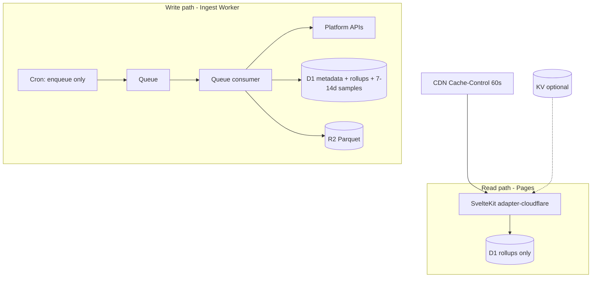

# Cloudflare deployment

Target: **SvelteKit on Pages** (read path) + **dedicated ingest Worker** (write path) on Cloudflare. See [ADR-004](./adr/0004-cloudflare-free-vs-paid.md). Code-level free-tier audit: [cloudflare-free-tier-audit](./audits/cloudflare-free-tier-audit.md). **Paid ingest budget / zero-overage:** [23-paid-tier-zero-overage-playbook](./23-paid-tier-zero-overage-playbook.md).

Official references: [Workers limits](https://developers.cloudflare.com/workers/platform/limits/) · [D1 pricing](https://developers.cloudflare.com/d1/platform/pricing/) · [Queues pricing](https://developers.cloudflare.com/queues/platform/pricing/) · [R2 pricing](https://developers.cloudflare.com/r2/pricing/) · [D1 + SvelteKit](https://developers.cloudflare.com/d1/examples/d1-and-sveltekit/) · [Cron Triggers](https://developers.cloudflare.com/workers/configuration/cron-triggers/) · [Queues](https://developers.cloudflare.com/queues/)

---

## Architecture (validated)



| Layer | Service | Role |
|-------|---------|------|
| Public UI | **Pages** + `@sveltejs/adapter-cloudflare` | SSR rankings; **never** poll Twitch/YouTube in `+page.server.ts` |
| Ingest | **Separate Worker** | Cron → Queue → API polls → D1 + R2 |
| OLTP | **D1** | Channels, sessions, rollups, short hot samples |
| Cold | **R2** | Parquet archives; no public bucket |
| Hot cache | **CDN** primary; **KV** optional | Prebuilt ranking JSON |
| Long jobs | **Workflows** (Phase 4+) | VOD backfill only — not live polling |

---

## Free vs Paid decision

| Stage | Plan | Why |
|-------|------|-----|
| Local dev | SQLite + `wrangler dev` | No limits |
| Prototype UI on CF | Workers **Free** | OK for Pages + light D1 reads |
| **Production ingest (1–2 min polls)** | Workers **Paid** (~$5/mo min) | Free tier: **10 ms CPU**/invocation, **10k Queue ops/day**, **100k D1 writes/day**. Paid removes **daily** D1 caps; **monthly** included quotas still apply ([D1 pricing](https://developers.cloudflare.com/d1/platform/pricing/)) — see [23-paid-tier-zero-overage-playbook](./23-paid-tier-zero-overage-playbook.md). |

### Limit math (why Free breaks ingest)

| Resource | Free tier | OmniCharts stress |
|----------|-----------|-------------------|
| D1 writes | 100k/day | 2k channels × 1 sample/min ≈ **2.9M rows/day** without batching/rollup strategy |
| Queue ops | 10k/day ([Feb 2026](https://developers.cloudflare.com/changelog/post/2026-02-04-queues-free-plan/)) | ~**3.3k messages/day** max at 3 ops/message (ingest fan-out exhausts this fast) |
| CPU | 10 ms/invocation | Parquet encode / heavy SQL rollup fails |
| Cron CPU | 10 ms | Cannot poll entire catalog inside cron handler |

**Policy:** MVP development on Free; **claim “live 1–2 min ingest” only on Paid** (or aggressive sample batching + tiny tracked set on Free).

---

## Pages vs Workers

| Workload | Where |
|----------|--------|
| SvelteKit routes, `+page.server.ts`, `+server.ts` | **Pages** (single `_worker.js` from adapter) |
| Cron, Queue consumer, daily rollup | **`workers/ingest`** |
| EventSub webhook (Twitch) | Ingest Worker route or separate Worker |

Pages Functions share Workers [pricing/limits](https://developers.cloudflare.com/workers/platform/pricing/).

---

## Cron vs Queues vs Workflows

| Mechanism | Use | Do not use for |
|-----------|-----|----------------|
| [Cron](https://developers.cloudflare.com/workers/configuration/cron-triggers/) | Enqueue `{ type: "poll_platform", platform }` every 1–2 min; daily rollup 00:15 UTC | Per-channel Helix calls; heavy SQL |
| [Queues](https://developers.cloudflare.com/queues/) | `poll_channel_batch`, retries, DLQ | Sub-minute scheduling alone |
| [Workflows](https://developers.cloudflare.com/workflows/) | Multi-step VOD backfill with retries | Minute-by-minute live polls |

**Cron handler sketch:** only `send` / `sendBatch` to queue — never block on platform APIs.

---

## D1 best practices

| Rule | Detail |
|------|--------|
| UI queries | `channel_daily_rollups` / `game_daily_rollups` only |
| Indexes | `(platform_id, date)`, sort keys for HW/AV — [use indexes](https://developers.cloudflare.com/d1/best-practices/use-indexes/) |
| Homepage | `env.DB.batch([...])` — **50 D1 queries/invocation** (Free), **1,000** (Paid) ([D1 limits](https://developers.cloudflare.com/d1/platform/limits/)) |
| Row reads | Billed on **rows scanned** — avoid `SELECT *` on wide tables |
| Storage | **500 MB**/database (Free), **10 GB**/database (Paid); **5 GB**/account (Free), **1 TB**/account (Paid) — cannot hold 365d raw samples |
| Query time | 30s max — chunk daily rollups |

Log `meta.rows_read` / `rows_written` from D1 results in ingest ([observability](./14-observability-slos-and-error-budgets.md)).

---

## R2 patterns

- Keys: `samples/year=YYYY/month=MM/day=DD/platform=twitch/part-{uuid}.parquet`
- Writes: ingest consumer only
- Reads: offline DuckDB on laptop — **not** Workers request path
- Egress to Internet: $0; Class B GETs metered after free tier

---

## Caching (60s rankings)

| Layer | Strategy |
|-------|----------|
| **CDN** | `Cache-Control: public, max-age=60` on SSR ranking pages |
| **KV** (optional) | Key `rankings:{platform}:{period}` — refresh after rollup |
| **Cache API** | Per-PoP only — [not global](https://developers.cloudflare.com/workers/runtime-apis/cache/) |

**Do not** rely on Cache API alone for worldwide consistency.

---

## SvelteKit on Pages

### `app.d.ts`

```ts
interface Platform {
  env: {
    DB: D1Database;
    TWITCH_MIN_VIEWERS?: string;
    TWITCH_RANKING_MIN_AIRTIME_MINUTES?: string;
  };
  context: { waitUntil(promise: Promise<unknown>): void };
  caches: CacheStorage & { default: Cache };
}
```

### `+page.server.ts`

```ts
export const load = async ({ platform }) => {
  const db = platform!.env.DB;
  const { results } = await db.prepare(
    `SELECT c.slug, c.display_name, SUM(r.hours_watched) AS hw
     FROM channel_daily_rollups r
     JOIN channels c ON c.id = r.channel_id
     WHERE c.platform_id = ? AND r.date >= date('now', '-7 days')
     GROUP BY c.id ORDER BY hw DESC LIMIT 100`
  ).bind('twitch').all();
  return { rankings: results };
};
```

### SSR vs prerender

| Route | Strategy |
|-------|----------|
| `/`, `/channels/*`, `/games/*`, `/overview` | SSR — `prerender = false` |
| `/methodology`, legal | Prerender OK |

### Local dev

```bash
# Web (Pages + D1 via adapter platformProxy) — from apps/web
cd apps/web
npm run dev

# Optional: preview built Pages worker + assets
npm run build
npx wrangler pages dev .svelte-kit/cloudflare

# Ingest Worker — separate terminal
cd workers/ingest
npx wrangler dev
```

**Why not `pages dev -- npm run dev`:** Wrangler 4 deprecates the `[COMMAND]` positional on `pages dev` ([docs](https://developers.cloudflare.com/workers/wrangler/commands/pages/#pages-dev)). Use `npm run dev` with `preview_database_id = "DB"` in `wrangler.jsonc` ([doc 19](./19-project-scaffold-and-commands.md#1d-cloudflare-preview-two-flows)).

---

## Wrangler: Pages (`apps/web/wrangler.jsonc`)

```jsonc
{
  "name": "omnicharts-web",
  "compatibility_date": "2026-06-01",
  "compatibility_flags": ["nodejs_als"],
  "pages_build_output_dir": ".svelte-kit/cloudflare",
  "vars": {
    "TWITCH_MIN_VIEWERS": "2",
    "TWITCH_RANKING_MIN_AIRTIME_MINUTES": "1"
  },
  "d1_databases": [{
    "binding": "DB",
    "database_name": "omnicharts",
    "database_id": "<production-id>",
    "preview_database_id": "DB",
    "migrations_dir": "../../migrations/d1"
  }],
  "env": {
    "production": {
      "vars": {
        "TWITCH_MIN_VIEWERS": "20",
        "TWITCH_RANKING_MIN_AIRTIME_MINUTES": "60"
      }
    }
  }
}
```

**Ranking eligibility:** Pages reads `TWITCH_*` from `platform.env` (wrangler `vars`), same keys as ingest `env.production` ([23-paid-tier-zero-overage-playbook](./23-paid-tier-zero-overage-playbook.md)). Local `vite dev` uses adapter **`platformProxy`** + `preview_database_id = "DB"` ([doc 19](./19-project-scaffold-and-commands.md#1d-cloudflare-preview-two-flows)). Production vars: `TWITCH_MIN_VIEWERS=20`, `TWITCH_RANKING_MIN_AIRTIME_MINUTES=60` in both `apps/web/wrangler.jsonc` and ingest `env.production.vars`.

**No KV on web:** SSR rankings use direct D1 + `Cache-Control: public, max-age=60` (optional KV is P2 — [cloudflare-hardening-complete](./audits/cloudflare-hardening-complete.md)).

---

## Wrangler: Ingest (`workers/ingest/wrangler.jsonc`)

Config is **JSONC** (not TOML) with `env.staging` / `env.production`. Ground truth: repo file + [23-paid-tier-zero-overage-playbook](./23-paid-tier-zero-overage-playbook.md) §4.

```jsonc
{
  "name": "omnicharts-ingest",
  "main": "src/index.ts",
  "compatibility_date": "2026-06-01",
  "compatibility_flags": ["nodejs_compat"],
  "triggers": { "crons": ["*/1 * * * *", "15 0 * * *", "0 */6 * * *"] },
  "d1_databases": [{
    "binding": "DB",
    "database_name": "omnicharts",
    "database_id": "<production-id>",
    "migrations_dir": "../../migrations/d1"
  }],
  "r2_buckets": [{ "binding": "SAMPLES", "bucket_name": "omnicharts-samples" }],
  "queues": {
    "producers": [{ "binding": "INGEST_QUEUE", "queue": "omnicharts-ingest" }],
    "consumers": [{
      "queue": "omnicharts-ingest",
      "max_batch_size": 5,
      "max_retries": 2,
      "dead_letter_queue": "omnicharts-ingest-dlq"
    }]
  },
  "env": {
    "staging": {
      "triggers": { "crons": ["*/5 * * * *", "15 0 * * *", "0 */6 * * *"] },
      "vars": {
        "INGEST_COVERAGE_MODE": "shards_only",
        "LIVE_SWEEP_MAX_PAGES": "3",
        "TWITCH_MAX_TRACKED": "200"
      }
    },
    "production": {
      "limits": { "cpu_ms": 30000 },
      "vars": {
        "INGEST_COVERAGE_MODE": "full",
        "LIVE_SWEEP_MAX_PAGES": "40",
        "TWITCH_MIN_VIEWERS": "20",
        "TWITCH_RANKING_MIN_AIRTIME_MINUTES": "60",
        "SAMPLE_ARCHIVE_ENABLED": "0"
      },
      "queues": {
        "consumers": [{
          "queue": "omnicharts-ingest",
          "max_batch_size": 3,
          "max_retries": 3,
          "dead_letter_queue": "omnicharts-ingest-dlq"
        }]
      }
    }
  }
}
```

**Deploy:** `cd workers/ingest && npx wrangler deploy --env staging` (Free) or `--env production` (Paid). Root dev vars (`TWITCH_MIN_VIEWERS=2`, airtime `1`) apply outside named envs — local checkpoint friendly.

**One-time (before first ingest deploy with queue bindings):**

```bash
npx wrangler queues create omnicharts-ingest
npx wrangler queues create omnicharts-ingest-dlq
```

Secrets ([secret put](https://developers.cloudflare.com/workers/wrangler/commands/workers/#secret-put)):

```bash
cd workers/ingest
npx wrangler secret put TWITCH_CLIENT_SECRET
# repeat for YOUTUBE_*, KICK_*, etc.
```

---

## Anti-patterns

| Do not | Because |
|--------|---------|
| DuckDB / Parquet encode in Workers | No DuckDB in V8; CPU blow |
| Rollups in `+page.server` | Timeouts + wrong layer |
| Scan all `viewer_samples` in UI | D1 read quota |
| Poll platforms from Pages | Couples traffic to ingest |
| Cron polls full catalog | 10 ms CPU on Free |
| Public R2 for samples | Privacy |
| Global mutable Worker state for rate limits | Wrong across isolates |
| Workflows for 60s polls | Cost/complexity |

---

## Queue budget formula

```
ops_per_day ≈ messages_delivered × 3
```

Free tier **10k ops/day** → ~3k messages/day max. Size batches so one message polls up to N channels per platform.

---

## D1 write budget (planning)

Target architecture:

1. Batch insert samples (multi-row `INSERT`).
2. Prune hot samples after 7–14 days.
3. Daily rollup writes **one row per channel per day**, not per sample.

Illustrative: 500 live channels × 1440 samples/day = 720k samples → **must** batch, prune, or reduce poll rate on Free.

---

## Environments

| Env | Cron | D1 |
|-----|------|-----|
| `staging` | `*/5 * * * *` (override in dashboard if needed) | Preview DB |
| `production` | 1–2 min enqueue | Production DB |

### Free-tier staging ingest

For **Workers Free** demo/staging (not production minute-level coverage), deploy ingest with `wrangler deploy --env staging` or set:

| Var | Staging default | Purpose |
|-----|-----------------|--------|
| `INGEST_COVERAGE_MODE` | `shards_only` | Catalog shard poll only — no full `runTwitchCoverageCycle` per minute |
| `LIVE_SWEEP_MAX_PAGES` | `3` | Cap global sweep when mode is `sweep_only` or admin quick poll |
| `TWITCH_MAX_TRACKED` | `200` | Smaller catalog |
| `TWITCH_MIN_VIEWERS` | `20` | Same as prod gate |

Production (`--env production`) sets `INGEST_COVERAGE_MODE=full`. Modes: `full` (sweep + game pass + reconcile), `shards_only`, `sweep_only`.

**Do not claim 1–2 min live ingest on Free** — use Paid ingest per [ADR-004](./adr/0004-cloudflare-free-vs-paid.md) and [free-tier audit](./audits/cloudflare-free-tier-audit.md).

### Public ingest hardening

| Surface | Behavior |
|---------|----------|
| `GET /v1/*` | In-worker per-IP token bucket in production (`INGEST_RATE_LIMIT_PER_MINUTE`, default **60**/min). Bypass when `ENVIRONMENT` ≠ `production` (local `verify:twitch`). |
| `GET /health` | Public: `status`, `db`, `twitch`, `tracked_channels`, `channels_live`, `timestamp`. Full metrics: `GET /health?detailed=1` + `X-Admin-Api-Key`. |
| `GET /admin/twitch/rankings*` | **308** redirect to `/v1/rankings/*` |

Grounding: [Workers limits](https://developers.cloudflare.com/workers/platform/limits/), [D1 limits](https://developers.cloudflare.com/d1/platform/limits/), [D1 indexes](https://developers.cloudflare.com/d1/best-practices/use-indexes/).

---

## Failure modes

| Symptom | Likely cause | Action |
|---------|--------------|--------|
| Rankings stale | Ingest lag | Check [ingest runbook](./15-ingest-runbook.md) |
| Error 1102 | CPU exceeded | Paid plan or smaller batch |
| D1 daily limit | Too many writes | Prune samples; reduce tracked set |
| Queue backlog > 24h | Consumer too slow | Scale batches; Paid CPU |
| Empty Kick table | Hidden viewer counts / API | See [ADR-003](./adr/0003-kick-ingest-strategy.md) |

---

## Production deploy checklist

Use before first prod cut or after schema/ingest changes. Full ops detail: [15-ingest-runbook](./15-ingest-runbook.md#deploy-checklist). Commands: [19](./19-project-scaffold-and-commands.md).

| Step | Action |
|------|--------|
| 1 | `bun run d1:migrate:remote` — **from `workers/ingest`** (shared `migrations/d1/`) |
| 2 | `bun run d1:verify-schema:remote` — parity through migration `0006` |
| 3 | Set production ingest **and Pages** vars (`TWITCH_RANKING_MIN_AIRTIME_MINUTES=60`, `TWITCH_MIN_VIEWERS=20`) and `wrangler secret put` for Twitch + **`ADMIN_API_KEY`** |
| 4 | Deploy **ingest Worker** before Pages |
| 5 | Deploy Pages; verify `/health` and homepage rankings |
| 6 | Confirm no `*/2` placeholder cron (removed until Kick/YouTube Phase 3) |

Pre–Kick freeze criteria: [23-audit-remediation-plan](./23-audit-remediation-plan.md#2-freeze-gate-twitch-frozen--kick-may-start).

---

## Related docs

- [27-monorepo-shared-packages.md](./27-monorepo-shared-packages.md) — workspace import graph
- [19-project-scaffold-and-commands.md](./19-project-scaffold-and-commands.md) — **CLI setup first** ([`npx sv create`](https://svelte.dev/docs/kit/creating-a-project) + Cloudflare adapter)
- [06-storage-and-rollup-design.md](./06-storage-and-rollup-design.md)
- [14-observability-slos-and-error-budgets.md](./14-observability-slos-and-error-budgets.md)
- [15-ingest-runbook.md](./15-ingest-runbook.md)
- [22-ingest-free-tier-tuning.md](./22-ingest-free-tier-tuning.md) — operator playbook for Free/staging ingest
- [23-paid-tier-zero-overage-playbook.md](./23-paid-tier-zero-overage-playbook.md) — Workers Paid budgets, calculators, rollout
