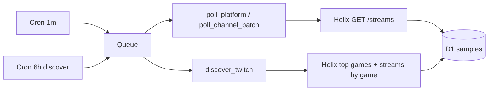

# Twitch libraries & Helix polling (Phase 1)

**Decision date:** 2026-06-01  
**Implementation:** `workers/ingest/src/twitch/` (fetch-based Helix client)

---

## Library landscape (2026)

| Package | Latest (npm) | Role | OmniCharts use |
|---------|--------------|------|----------------|
| **[@twurple/api](https://www.npmjs.com/package/@twurple/api)** + **[@twurple/auth](https://www.npmjs.com/package/@twurple/auth)** | **8.1.4** (May 2026) | Full Helix + built-in `@d-fischer/rate-limiter`, batched `getStreamsByUserIds` | **Recommended for Node scripts** (seeds, backfills, local CLI) |
| **[@twurple/eventsub-http](https://www.npmjs.com/package/@twurple/eventsub-http)** | 8.1.x | EventSub webhook verify + handlers | Phase 1b on Worker (or manual HMAC first) |
| **Raw `fetch`** | — | `id.twitch.tv` + `api.twitch.tv` | **Ingest Worker (Phase 1)** — no Node-only deps, full control on Workers |

### Why not Twurple inside the ingest Worker (yet)

Twurple 8.x depends on Node-oriented utilities (`@d-fischer/detect-node`, rate-limiter stack). Cloudflare Workers can run some of this with `nodejs_compat`, but bundle size and subtle runtime gaps are common. Official Twitch docs are **REST + headers** ([Helix guide](https://dev.twitch.tv/docs/api/guide)); a thin client matches [ADR-002](./adr/0002-twitch-eventsub-vs-polling.md).

**When to add Twurple:** local ingest admin scripts under `scripts/ingest/`, or after we confirm `@twurple/api` + vitest-pool-workers in CI.

---

## Rate limits (still Helix in 2026)

| Limit | Value | Source |
|-------|--------|--------|
| Default bucket | **800 points / minute** per client ID | [Twitch API concepts](https://dev.twitch.tv/docs/api/guide#twitch-rate-limits) |
| `GET /streams` | **1** point; max **100** `user_id` per call | [Get Streams](https://dev.twitch.tv/docs/api/reference#get-streams) |
| `GET /games/top` | **1** point | [Get Top Games](https://dev.twitch.tv/docs/api/reference#get-top-games) |
| `GET /streams?game_id=` | **1** point per page | Discovery |
| `GET /users` | **1** point; max **100** `id` per call | Tier B profile (`avatar_url`, `description`, …) |
| `GET /channels` | **1** point; max **100** `broadcaster_id` per call | Tier B offline shell → `channel_profile_json` |
| 429 handling | Read `Ratelimit-Remaining`, `Ratelimit-Reset` | Same guide |

### OmniCharts budget (MVP)

We target **~720 points/min** global safe budget (**800 − 80 headroom**) via `helixSafePointsPerMinuteFromEnv` in [`helix-budget.ts`](../workers/ingest/src/twitch/helix-budget.ts). Per-queue-consumer budget splits when `INGEST_COVERAGE_MODE=full` (**2** parallel fan-out messages share one client-id bucket: sweep+game inline, reconcile separate — [ADR-0006](./adr/0006-twitch-pagination-coverage.md)).

| Workload | Approx. cost / min | Notes |
|----------|-------------------|--------|
| **Production** `INGEST_COVERAGE_MODE=full` | **~96** configured max (40 sweep + 5×12 game + 15 reconcile) | Wrangler `LIVE_SWEEP_MAX_PAGES=40`, `GAME_PASS_GAMES_PER_CYCLE=5`; governor throttles lower on `Ratelimit-Remaining` |
| Poll **800** tracked IDs (8×100) | **8** | `shards_only` / catalog batch path — reserved from safe budget |
| Poll **3000** tracked IDs | **30** | Still fits; cap catalog per [12-channel-discovery](./12-channel-discovery-and-tracking.md) |
| **Free staging** `shards_only` + auto light sweep | **&lt;10** typical | Wrangler staging vars; no operator `.dev.vars` flags |
| Discovery (6h): top 100 games + 40 games × 10 pages | **~400** once | Spread with `rateLimit.consume()`; **10 pt/min** reserved in budget math |
| Profile enrichment (500 ch): 5×`GET /users` + 5×`GET /channels` | **~10** per run | After coverage / discovery; stale refresh 24h |
| Poll-time enrich (500 ch, followers skipped) | **~10** per run | `includeFollowers: false` on minute poll; rollup still fetches followers |
| `GET /games/top` in game-pass | **0** when cache warm | 6h cache in `ingest_metadata` (`top-games-cache.ts`); discovery refreshes |

**Helix polling is still required** for `viewer_count` — EventSub `stream.online` / `stream.offline` only boundaries ([ADR-002](./adr/0002-twitch-eventsub-vs-polling.md)).

### Auto-tuned caps (wrangler — not `.dev.vars`)

Operators deploy with `wrangler deploy --env staging|production`. Caps below live in [`wrangler.jsonc`](../workers/ingest/wrangler.jsonc); code derives Helix budget from mode + tracked count.

| Var | Staging | Production | Code default if unset |
|-----|---------|------------|------------------------|
| `INGEST_COVERAGE_MODE` | `shards_only` | `full` | `full` |
| `LIVE_SWEEP_MAX_PAGES` | `3` | `40` | `80` (full) / `3` (light) |
| `GAME_PASS_GAMES_PER_CYCLE` | `2` | `5` | `5` (full) / `2` (light) |
| `TWITCH_MAX_TRACKED` | `200` | `3000` | `3000` |

**Budget math (`helix-budget.ts`):**

```
safe_global = 800 − 80 headroom − 10 discovery_reserve − (shards_only ? ceil(tracked/100) : 0)
phase_budget = full ? floor(safe_global / 2) : safe_global   # COVERAGE_FANOUT_PHASES = 2
```

Each `TwitchHelixClient` on the production **`poll_twitch_coverage`** consumer uses the full `helixSafePointsPerMinuteFromEnv` budget across sweep, game pass, and reconcile sequentially. Legacy **`poll_twitch_sweep`** / **`poll_twitch_reconcile`** bodies remain for in-flight messages. **Sequential** inline coverage (`runTwitchCoverageCycle`, legacy `poll_platform`) shares the same pattern. Profile enrichment runs on the **6h discover cron** (`poll_twitch_enrich`), not per-minute reconcile. Dynamic governors in [`rate-limit.ts`](../workers/ingest/src/twitch/rate-limit.ts) cap sweep pages and game-pass slices when remaining points are low ([22-ingest-free-tier-tuning](./22-ingest-free-tier-tuning.md)).

**GitHub / Twurple pattern:** [@twurple/api](https://github.com/twitchtv/twurple) uses `@d-fischer/rate-limiter` with header-aware buckets — same contract as our fetch client (consume before call, read headers after). We split budget across parallel Workers queue consumers because Cloudflare has no shared in-memory limiter across isolates.

---

## Credentials (Worker)

| Name | Where | Purpose |
|------|--------|---------|
| `TWITCH_CLIENT_ID` | `.dev.vars` (local) / `wrangler secret put` (prod) | `Client-Id` header |
| `TWITCH_CLIENT_SECRET` | `.dev.vars` (local) / `wrangler secret put` (prod) | App access token |

Local:

```bash
cp workers/ingest/.dev.vars.example workers/ingest/.dev.vars
# fill TWITCH_CLIENT_ID + TWITCH_CLIENT_SECRET (+ EventSub vars for eventsub-sync)
bun run dev:ingest   # from repo root — loads workers/ingest/.dev.vars at startup
```

**Restart required:** Wrangler reads `.dev.vars` only when `wrangler dev` starts. After creating or editing `.dev.vars`, stop and re-run `bun run dev:ingest`. Confirm with `curl -sS http://127.0.0.1:8787/health` → `"twitch":"configured"`.

---

## Phase 1 ingest flow



### EventSub (implemented)

| Piece | Path / route |
|-------|----------------|
| Webhook handler | `POST /webhooks/twitch/eventsub` — `src/twitch/eventsub/handler.ts` |
| HMAC verify (Web Crypto) | `src/twitch/eventsub/verify.ts` — [Handling webhook events](https://dev.twitch.tv/docs/eventsub/handling-webhook-events/) |
| Subscribe / list / delete | `src/twitch/eventsub/subscriptions-api.ts` — [Manage subscriptions](https://dev.twitch.tv/docs/eventsub/manage-subscriptions/) |
| Sync tracked channels | `sync_eventsub_twitch` queue + `POST /admin/twitch/eventsub/sync` |
| Types | `stream.online` / `stream.offline` v1 — [Subscription types](https://dev.twitch.tv/docs/eventsub/eventsub-subscription-types/) |

**Env (`.dev.vars`):** `TWITCH_EVENTSUB_SECRET` (transport secret, **not** client secret), `TWITCH_EVENTSUB_CALLBACK_URL` (HTTPS :443).

**Local dev:** expose Worker via Cloudflare Tunnel; set callback URL to tunnel host + `/webhooks/twitch/eventsub`.

Polling still required for `viewer_count` ([ADR-002](./adr/0002-twitch-eventsub-vs-polling.md)).

**Helix `GET /streams` → D1 (migration `0004`):** ingest persists `language`, `tags` → `stream_sessions.tags_json`, `thumbnail_url`, `type` → `stream_type`, plus `channels.language` on each live hit. Deprecated `tag_ids` / `is_mature` ignored.

**Helix Tier B (migration `0005`, `src/twitch/enrich-profiles.ts`):** batched `GET /users` + `GET /channels` → `channels.avatar_url`, `description`, `broadcaster_type`, `platform_created_at`, `channel_profile_json`. Runs after coverage reconcile (up to 500 IDs), end of discovery (same cap), or `POST /admin/twitch/enrich-profiles` (stale tracked batch).

---

## References

- [Twurple 8.x docs](https://twurple.js.org/)
- [05-ingestion-per-platform.md](./05-ingestion-per-platform.md)
- Context7: `/websites/twurple_js_reference` (validated May 2026 line: 8.1.4 on npm)
