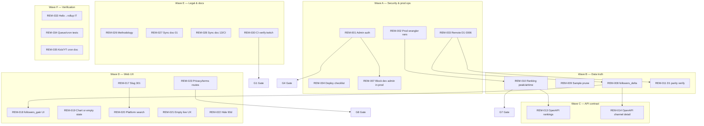

# Audit remediation plan (pre–Phase 3 Kick)

**Status:** G1 + G2 done (2026-06-03); G3–G12 open — see [26-twitch-freeze-execution-plan.md](./26-twitch-freeze-execution-plan.md).  
**Purpose:** Consolidate findings from eight pre-Kick audits (DB, ingest, API, web, ops, legal, testing, roadmap) into one ordered backlog before [Phase 3 — Multi-platform](./../ROADMAP.md#phase-3--multi-platform-weeks-710).  
**Gate command:** From repo root, with ingest running locally: `bun run verify:twitch` ([13-testing-and-verification.md](./13-testing-and-verification.md), [AGENTS.md](../AGENTS.md)).

Related: [20-documentation-standards.md](./20-documentation-standards.md) · [15-ingest-runbook.md](./15-ingest-runbook.md) · [18-legal-and-compliance-checklist.md](./18-legal-and-compliance-checklist.md)

### Audit doc map (no duplicate reading)

| Doc | Role |
|-----|------|
| **This file (23)** | REM backlog + freeze gate G1–G12 |
| [24](./24-remediation-grounding-audit.md) | Phase 0–2 operational matrix (proof commands) |
| [25](./25-dependency-and-api-grounding.md) | Helix, bindings, toolchain pins |
| [26](./26-twitch-freeze-execution-plan.md) | Gate status, M0–M5 milestones, next tasks |
| [audits/cloudflare-hardening-complete](./audits/cloudflare-hardening-complete.md) | **Current** CF ingest/web hardening checklist |
| [audits/cloudflare-free-tier-audit](./audits/cloudflare-free-tier-audit.md) | Baseline limits audit (historical findings) |
| [audits/ingest-d1-query-audit](./audits/ingest-d1-query-audit.md) | D1 write/read patterns |

---

## 1. Executive summary

Phase 2 Twitch discovery loop is **shipped** (homepage, channel/game pages, rollups, `/v1` APIs). **36 / 36** REM items done in code/tests/docs ([26](./26-twitch-freeze-execution-plan.md)). Wave A–F P0 fixes landed: admin auth, rollup truth (`followers_delta`, sample prune, peak/airtime), OpenAPI alignment, slug 301, platform search, legal stubs, `verify:twitch` CI.

**Freeze gate (2026-06-03):** **G1** ✅ full local `verify:twitch`; **G2** ✅ remote D1 through `0006+`. **Open:** G3 prod deploy vars proof, G11–G12 maintainer sign-off, EventSub prod callback ([24 matrix](./24-remediation-grounding-audit.md) — only documented **NEEDS_PROOF**). Kick/YouTube ingest stays Phase 3 until all G boxes close.

---

## 2. Freeze gate (Twitch frozen → Kick may start)

All boxes must be checked before starting Phase 3 Kick. **Live G1–G12 status and evidence:** [26 § Freeze gate checklist](./26-twitch-freeze-execution-plan.md#freeze-gate-checklist-g1g12) (do not duplicate here).

**Summary (2026-06-03):** G1 ✅ · G2 ✅ · G4–G10 ✅ · **Open:** G3 (prod vars proof), G11 (maintainer sign-off), G12 (matrix + `twitch:freeze-proof`).

**Commands:** [13-testing-and-verification.md](./13-testing-and-verification.md) — `bun run dev:ingest` then `bun run verify:twitch` (no `VERIFY_SKIP_CHECKPOINT`).

---

## 3. Remediation waves

### Wave overview

| Wave | Theme | Primary owner |
|------|--------|---------------|
| A | Security & prod ops | ops, ingest |
| B | Data truth | ingest, DB |
| C | API contract | ingest, docs |
| D | Web UX | web |
| E | Legal & docs | docs, web |
| F | Verification | ops, testing |

### Dependency graph

---

### Wave A — Security & prod ops

| ID | Pri | Title | Lanes | Files to touch | Acceptance criteria | Depends on | Effort | Owner |
|----|-----|-------|-------|------------------|---------------------|------------|--------|-------|
| [x] REM-001 | P0 | Protect mutating `/admin/*` with shared secret | ingest, ops | `workers/ingest/src/index.ts`, `workers/ingest/src/admin/auth.ts` (new), `workers/ingest/.dev.vars.example`, `workers/ingest/worker-configuration.d.ts`, `docs/15-ingest-runbook.md`, `package.json` (curl scripts add header) | `POST /admin/twitch/discover` without `Authorization: Bearer $ADMIN_SECRET` → 401; with valid secret → 200; secrets via `wrangler secret put ADMIN_SECRET` | — | M | ingest |
| [x] REM-002 | P0 | Align production Twitch threshold vars | ops, ingest | `workers/ingest/wrangler.jsonc`, `workers/ingest/.dev.vars.example`, `docs/12-channel-discovery-and-tracking.md`, `docs/15-ingest-runbook.md` | Deployed Worker: `TWITCH_RANKING_MIN_AIRTIME_MINUTES=60`, `TWITCH_MIN_VIEWERS=20`; local checkpoint still documented with `1` / `2` overrides | — | S | ops |
| [x] REM-003 | P0 | Apply remote D1 migration `0006` | DB, ops | `migrations/d1/0006_channel_sightings_followers.sql`, root `package.json` (`d1:migrate:remote`), `docs/15-ingest-runbook.md`, `docs/19-project-scaffold-and-commands.md` | `wrangler d1 migrations apply omnicharts --remote` from `workers/ingest` succeeds; `channel_sightings` + `followers_delta` column present | — | S | ops |
| [x] REM-004 | P1 | Expand deploy checklist (ingest before Pages, vars, secrets) | ops, roadmap | `docs/15-ingest-runbook.md`, `docs/11-cloudflare-deployment.md` | Checklist includes REM-002 vars, REM-001 secret, migration step, `/health` lag, rankings spot-check; links doc 19 only for CLI | REM-002, REM-003 | S | ops |
| [x] REM-005 | P1 | Document `ADMIN_API_KEY` rotation | ops | `docs/15-ingest-runbook.md` | Rotation steps: put secret → deploy → revoke old; no secret values in git | REM-001 | S | ops |
| [x] REM-006 | P1 | Single SSOT for D1 migrate cwd | ops, docs | `docs/06-storage-and-rollup-design.md`, `docs/19-project-scaffold-and-commands.md`, `docs/15-ingest-runbook.md` | One canonical path (`workers/ingest` vs `apps/web`) stated; conflicting line in doc 06 fixed | — | S | docs |
| [x] REM-007 | P0 | Disable `/admin/dev/*` in production | ingest, ops | `workers/ingest/src/index.ts`, `workers/ingest/wrangler.jsonc` (`ENVIRONMENT` or `vars`) | Production deploy returns 404 for `seed-rankings` and `reset-for-live-test`; local dev unchanged | REM-001 | S | ingest |

### Wave B — Data truth

| ID | Pri | Title | Lanes | Files to touch | Acceptance criteria | Depends on | Effort | Owner |
|----|-----|-------|-------|------------------|---------------------|------------|--------|-------|
| [x] REM-008 | P0 | Compute `followers_delta` in daily rollup | DB, ingest | `workers/ingest/src/rollup/daily-job.ts`, `workers/ingest/src/db/twitch.ts`, `workers/ingest/test/rollup-daily-job.spec.ts` | Rollup upsert sets `followers_delta` from prior-day `follower_count`; channel detail `followers_gain` non-null when snapshots exist; no longer hard-coded `NULL` on insert | REM-003 | M | ingest |
| [x] REM-009 | P0 | Prune `viewer_samples` older than 14 days | DB, ingest | `workers/ingest/src/rollup/daily-job.ts` or `workers/ingest/src/db/prune-samples.ts`, `workers/ingest/src/index.ts` (cron/queue), `docs/06-storage-and-rollup-design.md` | After rollup, DELETE samples where `sampled_at` &lt; now−14d; test proves row count drops; doc 06 retention matches code | — | M | ingest |
| [x] REM-010 | P0 | Rankings `peak_viewers` / `airtime_hours` from rollups | ingest, API | `workers/ingest/src/ranking/top-channels.ts`, `workers/ingest/src/ranking/channels-api.ts`, `workers/ingest/src/rollup/daily-job.ts`, `workers/ingest/test/channels-api.spec.ts` | `GET /v1/rankings/channels` returns numeric peak and airtime per slug for period (aggregate from `channel_daily_rollups`), not `null` | REM-002 | M | ingest |
| [x] REM-011 | P1 | Remote D1 parity verification script | DB, testing | `scripts/verify/verify-d1-schema.ts`, `docs/13-testing-and-verification.md` | Script fails if missing tables/columns/indexes through **0008**; documented for pre-deploy | REM-003 | S | ops |
| [x] REM-012 | P1 | Unify ranking eligibility min airtime source | ingest | `workers/ingest/src/ranking/eligibility.ts`, `workers/ingest/src/twitch/config.ts`, `workers/ingest/src/rollup/daily-job.ts` | Query path uses `rankingMinAirtimeMinutesFromEnv` consistently with `MIN_RANKING_AIRTIME_MINUTES` default 60 | REM-002 | S | ingest |

### Wave C — API contract

| ID | Pri | Title | Lanes | Files to touch | Acceptance criteria | Depends on | Effort | Owner |
|----|-----|-------|-------|------------------|---------------------|------------|--------|-------|
| [x] REM-013 | P0 | Align OpenAPI rankings with implementation | API, docs | `openapi/v1.yaml`, `workers/ingest/test/channels-api.spec.ts`, `openapi/README.md` | Either schema marks `peak_viewers`/`airtime_hours` nullable with documented semantics, or implementation matches required fields after REM-010; `spectral`/lint passes | REM-010 | S | docs |
| [x] REM-014 | P1 | OpenAPI channel detail + daily points | API, docs | `openapi/v1.yaml`, `workers/ingest/src/ranking/channel-api.ts` | `followers_gain`, `stream_count`, `airtime_hours` on daily rows match live JSON; example fixtures updated | REM-008 | S | docs |
| [x] REM-015 | P2 | Defer standardized platform error codes | API, roadmap | `docs/07-api-spec.md`, `openapi/v1.yaml` (comment) | Document: `invalid_platform` / empty items for Kick until Phase 3; no breaking change for Twitch | — | S | docs |
| [x] REM-016 | P2 | Add `stream_count` to rankings items if product wants parity | API, ingest | `openapi/v1.yaml`, `workers/ingest/src/ranking/channels-api.ts` | Optional field present in API + spec when enabled | REM-010 | S | ingest |

### Wave D — Web UX

| ID | Pri | Title | Lanes | Files to touch | Acceptance criteria | Depends on | Effort | Owner |
|----|-----|-------|-------|------------------|---------------------|------------|--------|-------|
| [x] REM-017 | P0 | `slug_history` → 301 redirect | web, API | `apps/web/src/hooks.server.ts` or `apps/web/src/routes/channels/[slug]/+page.server.ts`, `workers/ingest/src/search/channels.ts`, `docs/16-search-and-resolution.md` | Request `/channels/old?platform=twitch` 301 to `new` when history row exists; ingest search resolves old slug | — | M | web |
| [x] REM-018 | P1 | Show `followers_gain` on channel page | web | `apps/web/src/routes/channels/[slug]/+page.svelte`, `apps/web/src/lib/server/channel.ts` | Metric card when `totals.followersGain != null`; hidden when null | REM-008 | S | web |
| [x] REM-019 | P1 | Viewership chart or honest empty state | web | `apps/web/src/routes/channels/[slug]/+page.svelte`, chart component (new), `apps/web/src/lib/server/channel.ts` | If `daily.length >= 2`, render HW/AV chart from rollup; else keep explicit “not enough history” copy (no fake data) | — | M | web |
| [x] REM-020 | P0 | Homepage/search platform tab sync | web | `apps/web/src/routes/+page.svelte`, `apps/web/src/routes/search/+page.svelte`, `apps/web/src/lib/components/ui/SearchChannels.svelte` | `SearchChannels` receives `platform` from active tab / `data.platform`; autocomplete query uses same `platform` param | — | S | web |
| [x] REM-021 | P1 | Empty live-now UX when `channels_live === 0` | web | `apps/web/src/routes/+page.svelte`, `apps/web/src/lib/components/ui/LiveNowStrip.svelte` | Strip hidden or shows “No tracked channels live” without looking broken | — | S | web |
| [x] REM-022 | P1 | Hide `90d` period until Phase 4 retention | web, docs | `apps/web/src/lib/mock/home.ts`, `apps/web/src/lib/components/ui/PeriodSelector.svelte`, `docs/01-competitive-parity-matrix.md` | UI periods `24h`/`7d`/`30d` only; selecting `90d` via URL falls back to `30d` with note | — | S | web |
| [x] REM-023 | P0 | Ship `/privacy` and `/terms` stub routes | web, legal | `apps/web/src/routes/privacy/+page.svelte`, `apps/web/src/routes/terms/+page.svelte`, `apps/web/src/lib/components/layout/Footer.svelte`, `docs/18-legal-and-compliance-checklist.md` | Routes return 200 with placeholder sections per doc 18 outline; footer links work | — | S | web |
| [x] REM-036 | P0 | No mock/seed in user-facing path | web, ingest | `apps/web/src/lib/server/rankings.ts`, `game-rankings.ts`, `overview.ts`, `dev-mock.ts`, `workers/ingest/src/dev/admin-guard.ts`, `index.ts` | Ingest down or empty → empty/unavailable UI, not fake leaderboards; demo only via `?demo=1` or `DEV_MOCK=1`; `POST /admin/dev/*` 404 in production unless `ALLOW_DEV_SEED=1`; `verify:twitch` does not require `dev:seed-rankings` | REM-007 | S | web |

### Wave E — Legal & docs

| ID | Pri | Title | Lanes | Files to touch | Acceptance criteria | Depends on | Effort | Owner |
|----|-----|-------|-------|------------------|---------------------|------------|--------|-------|
| [x] REM-024 | P1 | Methodology: followers delta + sample retention | docs, web | `docs/17-methodology-page.md`, `apps/web/src/routes/methodology/+page.svelte` | Page mentions follower delta, 14d hot samples, ranking gates (60m airtime) | REM-008, REM-009 | S | docs |
| [x] REM-025 | P1 | Sync parity matrix to shipped Phase 2 | roadmap, docs | `docs/01-competitive-parity-matrix.md` | H1–H5, H7a, H8a/b marked shipped for Twitch; H7b partial noted; 90d row matches REM-022 | REM-022 | S | docs |
| [x] REM-026 | P1 | Sync doc 13 with `verify:twitch` + CI | testing, docs | `docs/13-testing-and-verification.md`, `AGENTS.md` | Doc lists exact `verify:twitch` steps matching `scripts/verify/twitch-e2e-verify.ts`; CI row points to REM-030 | REM-030 | S | docs |
| [x] REM-027 | P1 | Sync doc 16 resolution checklist | docs | `docs/16-search-and-resolution.md` | Checkboxes: slug 301, platform-scoped search, FTS5 still deferred | REM-017, REM-020 | S | docs |
| [x] REM-028 | P1 | Runbook: prod vars, admin auth, migrate path | ops, docs | `docs/15-ingest-runbook.md` | Sections for REM-001, REM-002, REM-003, kick/youtube cron behavior | REM-001, REM-002, REM-035 | S | docs |
| [x] REM-029 | P1 | ROADMAP: pre-Kick remediation tranche | roadmap | `ROADMAP.md` | New bullet under Phase 3 entry: “Twitch freeze gate ([23](./23-audit-remediation-plan.md)) complete” | G1–G11 | S | docs |

### Wave F — Verification

| ID | Pri | Title | Lanes | Files to touch | Acceptance criteria | Depends on | Effort | Owner |
|----|-----|-------|-------|------------------|---------------------|------------|--------|-------|
| [x] REM-030 | P0 | GitHub Actions: `bun run verify:twitch` | testing, ops | `.github/workflows/verify-twitch.yml` (new), `docs/13-testing-and-verification.md` | PR workflow runs ingest tests, web tests, starts ingest or mocks health per script; fails on regression | — | M | ops |
| [x] REM-031 | P1 | Integration test: Helix fixture → samples → rollup | testing, ingest | `workers/ingest/test/helix-to-rollup.integration.spec.ts`, `tests/fixtures/` | Mock streams JSON → poll handler → `viewer_samples` + `channel_daily_rollup` row with expected HW | REM-008 | M | ingest |
| [x] REM-032 | P1 | Queue/cron routing tests | testing, ingest | `workers/ingest/test/cron-messages.spec.ts`, `workers/ingest/src/index.ts` | Assert `*/2` cron enqueues kick+youtube; twitch-only handler; rollup message | — | S | ingest |
| [x] REM-033 | P1 | Document or gate Kick/YouTube cron no-op | ingest, ops | `workers/ingest/src/index.ts`, `docs/15-ingest-runbook.md` | Prod: either skip enqueue until Phase 3 or log `skipped_platform`; doc states current behavior | — | S | ingest |
| [x] REM-034 | P2 | OpenAPI lint in CI | testing | `.github/workflows/verify-twitch.yml`, `openapi/README.md` | CI runs `npx @redocly/cli lint openapi/v1.yaml`; fails on spec break | REM-013 | S | ops |
| [x] REM-035 | P2 | Optional Playwright smoke (homepage + channel) | testing, web | `e2e/smoke.spec.ts`, `package.json` | Smoke: `/` 200, `/channels/{slug}` 200 with seed; non-blocking in CI until stable | REM-023 | M | web |

---

## 4. What NOT to do before Kick

| Deferral | Reason |
|----------|--------|
| **Kick ingest** (poll, discovery, rankings) | Phase 3 scope; blocked on §2 freeze gate |
| **YouTube ingest** | Same; after Twitch frozen |
| **FTS5 / `search_channel_fts`** | [16-search](./16-search-and-resolution.md) — LIKE fallback sufficient for MVP |
| **H7b top-5 live strip** | [01-parity](./01-competitive-parity-matrix.md) — count + link only until Phase 4 `/live` |
| **Phase 6 API keys / Bearer auth for public API** | [07-api-spec](./07-api-spec.md), [ROADMAP](../ROADMAP.md) Phase 6 |
| **90-day rollup retention in UI** | Phase 4; hide selector (REM-022) |
| **Cross-platform merged rankings** | Phase 4+ per parity matrix |
| **R2 Parquet cold path** | Phase 4; prune (REM-009) is D1-only hot window |
| **Platform-specific error code matrix for Kick** | REM-015; ship with Kick API |

---

## 5. Suggested execution order (optional milestones)

| Milestone | Target | Work |
|-----------|--------|------|
| **M1 — Week 1** | Security + schema | REM-001, REM-007, REM-002, REM-003, REM-030 (CI skeleton) |
| **M2 — Week 1–2** | Data truth | REM-008, REM-009, REM-010, REM-012; re-run `verify:twitch` |
| **M3 — Week 2** | Contract + web P0 | REM-013, REM-017, REM-020, REM-023; REM-011 before first prod deploy |
| **M4 — Week 2–3** | UX polish + docs | REM-018, REM-019, REM-021, REM-022, Waves E + REM-031–033 |
| **M5 — Gate** | Kick start | Complete §2 table; REM-029 in ROADMAP; begin Phase 3 Kick per [ADR-003](./adr/0003-kick-ingest-strategy.md) |

---

## 6. Verification reference

All verify commands: [13-testing-and-verification.md](./13-testing-and-verification.md) (SSOT). Do not ask users to run manual discover/poll/rollup `curl` chains — use checkpoint/verify scripts ([AGENTS.md](../AGENTS.md)).

---

## Appendix: Audit source lanes (deduped)

| Lane | Themes merged into REM IDs |
|------|----------------------------|
| DB | `0006`, `followers_delta`, sample retention |
| ingest | Admin surface, rollup, rankings aggregates, cron |
| API | OpenAPI drift, nullable rankings |
| web | 301, search platform, charts, legal routes, periods |
| ops | Wrangler vars, deploy checklist, CI |
| legal | `/privacy`, `/terms`, methodology |
| testing | `verify:twitch`, integration, queue tests |
| roadmap | Phase 3 gate, deferrals |

**Item count:** 36 (`REM-001` … `REM-036`).

StrReplace