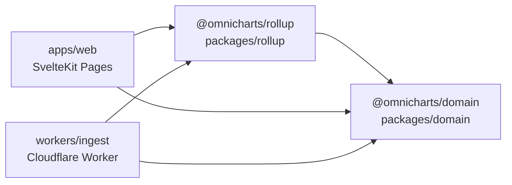

# Monorepo shared packages (2026)

**Purpose:** Import rules for `@omnicharts/*` workspace packages and the `ingest` worker library surface used by Pages D1 reads.

Related: [AGENTS.md](../AGENTS.md) · [19-project-scaffold-and-commands.md](./19-project-scaffold-and-commands.md) · [06-storage-and-rollup-design.md](./06-storage-and-rollup-design.md)

---

## Layout

| Path | Package | Role |
|------|---------|------|
| `packages/domain` | `@omnicharts/domain` | Platform IDs, ranking periods, ingest states — **zero runtime deps** |
| `packages/rollup` | `@omnicharts/rollup` | D1 rollup SQL + eligibility math — depends on `@omnicharts/domain` |
| `workers/ingest` | `ingest` | Cloudflare Worker + **subpath exports** for HTTP ranking builders and env helpers |
| `apps/web` | `web` | SvelteKit Pages — reads D1 via `@omnicharts/domain` + `@omnicharts/rollup` only |

Root `package.json` workspaces: `["apps/*", "workers/*", "packages/*"]`. Package manager: **Bun** (`packageManager: bun@1.3.14`).

---

## Import graph



| Consumer | Depends on | Does not import |
|----------|------------|-----------------|
| `apps/web` | `@omnicharts/domain`, `@omnicharts/rollup` | `ingest` workspace, Helix/cron/queue modules |
| `workers/ingest` | `@omnicharts/domain`, `@omnicharts/rollup` | Deep paths from `apps/web` |
| `@omnicharts/rollup` | `@omnicharts/domain` | ingest, web |

**SSOT:** Rollup SQL, eligibility, and OpenAPI-shaped ranking builders live in `@omnicharts/rollup`. Ingest route handlers use local `src/ranking/*` shims that re-export the same modules.

---

## Import rules

### Use `@omnicharts/domain` when

- Parsing or typing `PlatformId`, `RankingPeriod`, `IngestState`
- Referencing seed constants (`PLATFORM_TWITCH`, `DEFAULT_RANKING_PERIOD`, …)

```ts
import { PLATFORM_TWITCH, parseRankingPeriod, periodToDays } from '@omnicharts/domain';
```

**Do not** duplicate period/platform literals in app or ingest code.

### Use `@omnicharts/rollup` when

- Preparing or running D1 rollup ranking queries
- Eligibility helpers (`passesRankingEligibility`, `periodAverageViewers`, …)

```ts
import {
	prepareTopChannelsByHoursWatched,
	type ChannelRollupQueryRow
} from '@omnicharts/rollup';
```

**Rule (unchanged):** UI rankings read **rollups only** — never request-time sample scans ([AGENTS.md](../AGENTS.md)).

### Use `@omnicharts/rollup` from Pages (preferred)

Pages D1 loaders and `/api/v1/*` routes import ranking builders and env helpers from the rollup package — **not** the `ingest` workspace:

```ts
import { parseRankingPeriod } from '@omnicharts/domain';
import {
	buildRankingsChannelsResponse,
	rankingQueryOptionsFromEnv
} from '@omnicharts/rollup';
```

`rankingQueryOptionsFromEnv` accepts any object with `TWITCH_MIN_VIEWERS` / `TWITCH_RANKING_MIN_AIRTIME_MINUTES` (Pages `platform.env` or ingest `Env`).

### Use `ingest/…` subpath exports when

- Worker-external tooling needs ingest-only modules without pulling Worker internals
- Tests or scripts target the `ingest` package `exports` map explicitly

```ts
// ingest-only lag helpers; SQL SSOT is @omnicharts/rollup
import {
	fetchIngestOperationalMetrics,
	ingestLagSecondsFromMaxSample
} from 'ingest/health/operational-metrics';
import { TWITCH_LIVE_COUNT_SQL } from '@omnicharts/rollup';
```

**Do not** import ingest Twitch Helix, cron, or queue modules from `apps/web`. **Do not** add `ingest` as a dependency of `apps/web`.

### Forbidden patterns

| Pattern | Why |
|---------|-----|
| `@ingest` SvelteKit path alias | Removed — use `@omnicharts/*` workspace names |
| `ingest` workspace dep in `apps/web` | Rollup SSOT moved to `@omnicharts/rollup` |
| Deep imports into `workers/ingest/src/...` from web | Bypasses `exports` map; breaks bundling boundaries |
| Copy-paste rollup SQL into web | SSOT is `@omnicharts/rollup` |

---

## `ingest` export map

Defined in `workers/ingest/package.json`:

| Subpath | Module |
|---------|--------|
| `ingest/health/operational-metrics` | Ingest lag/metrics fetch + re-exports rollup live-count SQL (rankings/SQL: `@omnicharts/rollup`) |

Add new subpaths only for **ingest-only** modules shared outside the Worker. Ranking HTTP builders live in `@omnicharts/rollup`.

---

## Worker-internal re-exports

Inside `workers/ingest`, thin shims remain for backward compatibility:

- `src/ranking/period.ts` → re-exports `@omnicharts/domain`
- Eligibility + format helpers: import `@omnicharts/rollup` directly; env airtime override via `twitch/config.ts` (`rankingMinAirtimeMinutesFromEnv`)
- Ingest call sites use `PLATFORM_TWITCH` from `@omnicharts/domain`; `TWITCH_PLATFORM_ID` in `twitch/config.ts` remains a deprecated alias for external compat
- `workers/ingest/wrangler.jsonc` and `vitest.config.mts` alias `@omnicharts/*` to `packages/*/src` (monorepo source resolution)

---

## Bun monorepo practices (2026)

Grounded on [Bun workspaces](https://bun.com/docs/pm/workspaces) and [bun --filter](https://bun.com/docs/pm/filter) (May 2026):

| Practice | OmniCharts |
|----------|------------|
| Workspace globs in root `package.json` | `["apps/*", "workers/*", "packages/*"]` |
| Internal deps | `"workspace:*"` in each package `dependencies` |
| Install | `bun install` at repo root (hoists + dedupes) |
| Run scripts in one workspace | `bun run --filter web dev`, `bun run --filter ingest test` |
| Run scripts by path | `bun run --cwd workers/ingest dev` (ingest wrangler) |
| Scoped installs (CI) | `bun install --filter './packages/*'` when only packages changed |
| Shared devDependency versions | Optional [catalogs](https://bun.com/docs/pm/catalogs) in root — not required yet |
| Publish | N/A — private monorepo |

**Do not** hand-edit `node_modules` links; re-run `bun install` after changing workspace names or `exports` maps.

---

## Verify

From repo root ([doc 13](./13-testing-and-verification.md)):

```bash
bun install
bun run test:domain
bun run test:rollup
bun run test:ingest
bun run test:web
bun run check:web
bun run verify:twitch   # start dev:ingest first if health check needed
```

Package-only checks:

```bash
bun run check:domain
bun run check:rollup
```

---

## Correction log

| Date | Change |
|------|--------|
| 2026-06-03 | Initial shared packages doc; removed `@ingest` SvelteKit alias |
| 2026-06-03 | Lane 4/5: import graph diagram; Pages use `@omnicharts/*` only; Bun workspace practices |
| 2026-06-03 | Lane 3/5 ingest: `PLATFORM_TWITCH` migration; trimmed `ingest` exports; wrangler/vitest `@omnicharts/*` aliases |
| 2026-06-03 | Lane 5/5 gate: non-breaking checklist; ingest test spy fix; `homepage-d1.ts` repair |
| 2026-06-03 | P2 dedupe: ingest health → rollup operational SQL + `d1` batch helpers; `ranking/sort` re-export; dropped duplicate `format-metric` ingest test |

---

## Non-breaking checklist (lane 5/5 gate)

Verified 2026-06-03 after monorepo extraction lanes 1–4:

| Check | Result |
|-------|--------|
| `bun install` | clean lockfile |
| `bun run test:domain` | 7 pass |
| `bun run test:rollup` | 8 pass |
| `bun run test:ingest` | 276 pass |
| `bun run test:web` | 25 pass |
| `bun run check:web` | svelte-check 0 errors |
| `bun run verify:twitch` | 6/6 steps (dev:ingest running) |

**Breaking-change risk:** **none** — import paths changed for `apps/web` only; ingest Worker keeps `ingest/*` shims re-exporting `@omnicharts/rollup`. Public HTTP API and D1 schema unchanged.

**Fixes applied at gate:**

- Ingest ranking tests: spy `packages/rollup/src/*` submodules (not ingest re-export shims)
- `homepage-d1.ts`: restored corrupted type/function signature; `D1BatchResult` cast for batch counts
