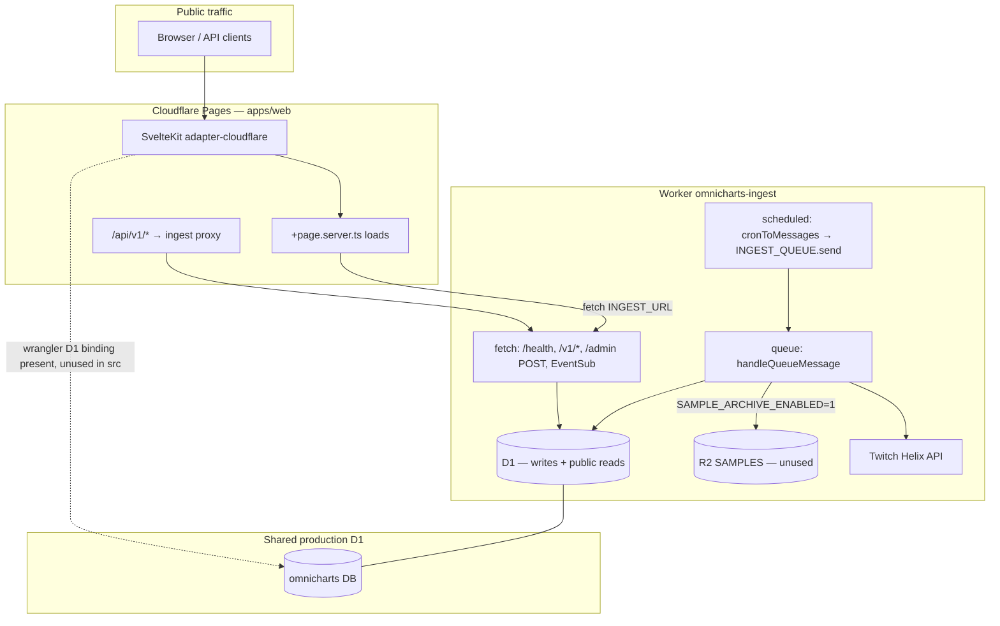

# Cloudflare free-tier audit — OmniCharts

> **Current state:** [cloudflare-hardening-complete.md](./cloudflare-hardening-complete.md) — do not treat severity tables below as open gaps without checking that checklist.

**Date:** 2026-06-03  
**Scope:** `workers/ingest/**`, `apps/web/**`, `wrangler.jsonc`, `migrations/d1/**`, `docs/adr/*`, `docs/11-cloudflare-deployment.md`  
**Goal:** Maximize value on Cloudflare **Free** where possible; document gaps vs production ingest (Paid per [ADR-004](../adr/0004-cloudflare-free-vs-paid.md)).

Official references used: [Workers limits](https://developers.cloudflare.com/workers/platform/limits/), [Workers pricing](https://developers.cloudflare.com/workers/platform/pricing/), [D1 pricing](https://developers.cloudflare.com/d1/platform/pricing/), [Queues pricing](https://developers.cloudflare.com/queues/platform/pricing/), [R2 pricing](https://developers.cloudflare.com/r2/pricing/), [Cron triggers](https://developers.cloudflare.com/workers/configuration/cron-triggers/), [Queues changelog (free plan)](https://developers.cloudflare.com/changelog/post/2026-02-04-queues-free-plan/).

---

## Paid tier (Workers Paid)

Production ingest per [ADR-004](../adr/0004-cloudflare-free-vs-paid.md) requires **Workers Paid** (~$5/mo minimum), not a separate “D1 paid plan.” D1, Queues, and R2 on a Paid Workers account use **monthly included quotas** with per-SKU overage ([D1 pricing](https://developers.cloudflare.com/d1/platform/pricing/), [Queues pricing](https://developers.cloudflare.com/queues/platform/pricing/)).

**Binding constraint at scale:** D1 **rows written** (minute-level `viewer_samples`), not Queue ops — `INGEST_COVERAGE_MODE=full` fan-out (~650k queue ops/mo) fits inside **1M ops/mo** included; `shards_only` at `TWITCH_MAX_TRACKED=3000` does not.

**Operator playbook:** [23-paid-tier-zero-overage-playbook.md](../23-paid-tier-zero-overage-playbook.md) (calculators, knobs, dashboards, phased rollout).

---

## 1. Executive summary

- **Production minute-level Twitch ingest cannot run on Workers Free** — one `poll_platform` queue message runs a full coverage cycle (up to ~80 Helix pages + game passes + reconcile), blowing **10 ms CPU**, **50 subrequests/invocation**, and **100k D1 writes/day** ([ADR-004](./adr/0004-cloudflare-free-vs-paid.md); `workers/ingest/src/index.ts:159-162`, `coverage.ts:21-53`).
- **Cron → queue enqueue pattern is correct** — `scheduled()` only `send`s messages; heavy work is in the consumer ([`index.ts:132-136`](../../workers/ingest/src/index.ts), [`cron-messages.ts:10-22`](../../workers/ingest/src/cron-messages.ts)).
- **Read path is rollup-first** — rankings and channel detail query `channel_daily_rollups` / `game_daily_rollups`, not `viewer_samples` ([`daily-job.ts:245-264`](../../workers/ingest/src/rollup/daily-job.ts), [`channel-api.ts:121-129`](../../workers/ingest/src/ranking/channel-api.ts)).
- **R2 archive optional** — NDJSON path in `sample-archive.ts` when `SAMPLE_ARCHIVE_ENABLED=1`; default off in production wrangler vars.
- **Public ingest API has no abuse controls** — `/v1/*` and `/health` are unauthenticated; Cache-Control helps JSON only if traffic hits the ingest Worker edge ([`index.ts:259-412`](../../workers/ingest/src/index.ts)).
- **Web Pages does not use bound D1** — SSR proxies to ingest via `INGEST_URL`; homepage duplicates ingest fetches ([`rankings.ts:45`](../../apps/web/src/lib/server/rankings.ts), [`+page.server.ts:18-35`](../../apps/web/src/routes/+page.server.ts)).
- **Write amplification is high** — per-stream ingest uses multiple sequential D1 statements; offline poll batch does per-user `UPDATE`; rollup/follower snapshots loop writes ([`poll.ts:77-84`](../../workers/ingest/src/twitch/poll.ts), [`twitch.ts:36-144`](../../workers/ingest/src/db/twitch.ts)).
- **Dedup exists in-process** — `seenUserIds` across sweep/game-pass; `ON CONFLICT DO NOTHING` on samples ([`stream-page.ts:20-28`](../../workers/ingest/src/twitch/stream-page.ts), [`twitch.ts:277-284`](../../workers/ingest/src/db/twitch.ts)).
- **Docs recommend `DB.batch()` and KV cache** — not implemented in app code ([`docs/11-cloudflare-deployment.md:91-114`](../../docs/11-cloudflare-deployment.md)).
- **Free-tier staging is viable** for UI + light read traffic; **beta “live 1–2 min” ingest requires Workers Paid** and architectural throttling (shard catalog poll, cap sweep pages, batch D1).

---

## 2. Free tier limits table

| Product | Free tier (daily unless noted) | OmniCharts touchpoint | Official URL |
|--------|--------------------------------|------------------------|--------------|
| Workers requests | 100,000 / day | Every cron tick, queue consumer, `/v1/*`, Pages SSR, ingest proxy | [Workers limits — Requests](https://developers.cloudflare.com/workers/platform/limits/) |
| Workers CPU | **10 ms** / HTTP request; **10 ms** / Cron Trigger | Coverage cycle, rollup, discovery in consumer | [Workers limits — CPU time](https://developers.cloudflare.com/workers/platform/limits/) |
| Workers subrequests | **50** / invocation (D1, fetch, R2 each count) | One `poll_platform` message: 80+ Helix fetches + hundreds of D1 calls | [Workers limits — Subrequests](https://developers.cloudflare.com/workers/platform/limits/) |
| Cron triggers | **5** per account | 4 crons in ingest wrangler | [Workers limits — Cron](https://developers.cloudflare.com/workers/platform/limits/) |
| Queues operations | **10,000** / day (reads+writes+deletes) | ~1,440 `send`/day (`*/1`) + consumer acks/retries; 24h retention on free | [Queues pricing](https://developers.cloudflare.com/queues/platform/pricing/) |
| D1 rows read | **5 million** / day | Rankings SQL, health `MAX(sampled_at)`, rollup `SELECT` day of samples | [D1 pricing](https://developers.cloudflare.com/d1/platform/pricing/) |
| D1 rows written | **100,000** / day | `viewer_samples`, channel upserts, rollups | [D1 pricing](https://developers.cloudflare.com/d1/platform/pricing/) |
| D1 storage | **5 GB** total per account | Hot `viewer_samples` + rollups + channels | [D1 pricing](https://developers.cloudflare.com/d1/platform/pricing/) |
| D1 statements / `batch()` | **50** statements per invocation (Free) | Not used today; rollup could batch upserts | [D1 best practices](https://developers.cloudflare.com/d1/best-practices/use-indexes/) |
| R2 storage | 10 GB-month (Standard) | Binding only — zero usage | [R2 pricing](https://developers.cloudflare.com/r2/pricing/) |
| R2 Class A ops | 1M / month | N/A until Parquet archival ships | [R2 pricing](https://developers.cloudflare.com/r2/pricing/) |
| Pages | Shares Workers request/CPU limits | SSR + API proxy routes | [Workers pricing — Pages](https://developers.cloudflare.com/workers/platform/pricing/) |

**Paid note (ingest):** Queue consumer and cron can use up to **30s CPU** (5 min with config) on Workers Paid — required for current coverage design ([Workers pricing — CPU](https://developers.cloudflare.com/workers/platform/pricing/)).

---

## 3. Architecture map



| Path | Component | Data source |
|------|-----------|-------------|
| Write | Cron `*/1` → `poll_platform` | Queue → `runTwitchCoverageCycle` |
| Write | Cron `0 */6` | `discover_twitch` + `sync_eventsub_twitch` |
| Write | Cron `15 0 * * *` | `rollup_daily` → rollups + prune samples |
| Read (UI) | Pages SSR | HTTP to ingest `/v1/*` (not direct D1) |
| Read (API) | Ingest or Pages proxy | D1 rollups / channels |
| Cold archive | R2 `SAMPLES` | NDJSON when `SAMPLE_ARCHIVE_ENABLED=1` |

---

## 4. Findings by subsystem

> **Note:** Severity tables below are the **pre-remediation baseline** (initial audit). See [Remediation status (2026-06-03)](#remediation-status-2026-06-03) and [cloudflare-hardening-complete.md](./cloudflare-hardening-complete.md) for current state.

### 4.1 Wrangler & bindings

| Finding | Severity | Evidence |
|---------|----------|----------|
| Ingest: D1 + R2 + Queues + 4 crons configured | Info | [`workers/ingest/wrangler.jsonc:17-69`](../../workers/ingest/wrangler.jsonc) |
| Web: D1 binding, no KV, no R2 | Info | [`apps/web/wrangler.jsonc:7-15`](../../apps/web/wrangler.jsonc) |
| R2 `SAMPLES` NDJSON archive (opt-in) | Info | [`sample-archive.ts`](../../workers/ingest/src/r2/sample-archive.ts); `SAMPLE_ARCHIVE_ENABLED=1` |
| 4 crons ≈ account limit of 5 on Free | P2 | [`wrangler.jsonc:18-23`](../../workers/ingest/wrangler.jsonc) |
| `*/2` cron is no-op (empty messages) | P2 | [`cron-messages.ts:14-15`](../../workers/ingest/src/cron-messages.ts) — still invokes Worker on schedule |

### 4.2 Cron & Queues

| Finding | Severity | Evidence |
|---------|----------|----------|
| **Good:** Cron only enqueues | — | [`index.ts:132-136`](../../workers/ingest/src/index.ts) |
| **Bad:** One message runs full coverage, not catalog shards | P0 | [`index.ts:159-162`](../../workers/ingest/src/index.ts) vs shard path [`poll.ts:17-35`](../../workers/ingest/src/twitch/poll.ts) (admin-only `poll-catalog`) |
| Queue consumer processes messages serially in batch | P2 | [`index.ts:139-153`](../../workers/ingest/src/index.ts) — no `sendBatch` from cron |
| Free queue budget ~3k delivered msgs/day at 3 ops each | P0 | 1,440 twitch cron sends + ack ≈ 2,880–4,320 ops before retries ([docs/11 — Queue budget](../../docs/11-cloudflare-deployment.md)) |
| DLQ + `max_retries: 3` multiplies ops on failure | P1 | [`wrangler.jsonc:60-67`](../../workers/ingest/wrangler.jsonc) |

**Rough ops/day (twitch cron only):** 1,440 sends + 1,440 consumes ≈ 2,880+ (approaching 10k with retries/admin).

### 4.3 D1 — writes & N+1

| Finding | Severity | Evidence |
|---------|----------|----------|
| Per live stream: upsert channel (2–4 SELECT + INSERT/UPDATE) + session + sample | P0 | [`upsertChannelFromStream`](../../workers/ingest/src/db/twitch.ts:36-144), [`recordLiveSample`](../../workers/ingest/src/db/twitch.ts:194-285) |
| `ingestHelixStream` per stream in sweep/game-pass | P0 | [`ingest-stream.ts:9-29`](../../workers/ingest/src/twitch/ingest-stream.ts) |
| Offline users in poll batch: 1 UPDATE each (up to 100) | P1 | [`poll.ts:77-84`](../../workers/ingest/src/twitch/poll.ts) |
| Daily rollup: per-channel + per-game `upsert` in loops | P1 | [`daily-job.ts:165-201`](../../workers/ingest/src/rollup/daily-job.ts) |
| Follower snapshots: per-channel metadata INSERT loop | **Fixed** | [`follower-snapshots.ts`](../../workers/ingest/src/db/follower-snapshots.ts) — `DB.batch()`; [ingest-d1-query-audit](./ingest-d1-query-audit.md) |
| Profile enrichment: per-channel UPDATE after batched Helix | P2 | [`enrich-profiles.ts:69-95`](../../workers/ingest/src/twitch/enrich-profiles.ts) |
| `DB.batch()` documented but **zero** usage in repo | P1 | Only in [`docs/11-cloudflare-deployment.md:91`](../../docs/11-cloudflare-deployment.md) |
| Sample dedup via `ON CONFLICT DO NOTHING` | Good | [`twitch.ts:277-284`](../../workers/ingest/src/db/twitch.ts) |
| Prune: batched DELETE 500 rows | Good | [`prune-samples.ts:24-40`](../../workers/ingest/src/db/prune-samples.ts) |
| No index on `viewer_samples.sampled_at` | P1 | Schema [`0001_init_schema.sql:43-49`](../../migrations/d1/0001_init_schema.sql); health uses `MAX(vs.sampled_at)` [`operational-metrics.ts:30-38`](../../workers/ingest/src/health/operational-metrics.ts) |

**Write order-of-magnitude (1 min coverage, illustrative):**  
500 live streams × ~6 writes ≈ 3,000 writes/min → **4.3M writes/day** without caps — far above 100k Free limit.

### 4.4 D1 — reads (public / health)

| Finding | Severity | Evidence |
|---------|----------|----------|
| Rankings channels: rollup JOIN, indexed sort keys | Good | [`daily-job.ts:245-264`](../../workers/ingest/src/rollup/daily-job.ts) |
| Rankings games: heavy `EXISTS` subquery on rollups + sessions | P1 | [`daily-job.ts:299-327`](../../workers/ingest/src/rollup/daily-job.ts) |
| Channel detail: rollups only for period | Good | [`channel-api.ts:121-129`](../../workers/ingest/src/ranking/channel-api.ts) |
| `/health`: multiple counts + **full scan** for max sample time | P1 | [`status.ts:37-53`](../../workers/ingest/src/health/status.ts), [`operational-metrics.ts:12-38`](../../workers/ingest/src/health/operational-metrics.ts) |
| Search: `LIKE %q%` on display_name | P2 | [`search/channels.ts:28-44`](../../workers/ingest/src/search/channels.ts) |

### 4.5 Subrequests & CPU (Free breaker)

| Finding | Severity | Evidence |
|---------|----------|----------|
| Coverage: up to 80 sweep pages + 5 games × 12 pages + reconcile batches + enrichment | P0 | [`config.ts:24-35`](../../workers/ingest/src/twitch/config.ts), [`coverage.ts:21-53`](../../workers/ingest/src/twitch/coverage.ts) |
| Helix client: each API call = `fetch` subrequest | P0 | [`helix.ts:68-120`](../../workers/ingest/src/twitch/helix.ts) |
| Each D1 `.prepare().run()` counts as subrequest | P0 | Cloudflare docs — subrequests to D1 |
| **>50 subrequests per `poll_platform` message** on typical load | P0 | Exceeds Free per-invocation cap |

### 4.6 Public endpoints & abuse

| Finding | Severity | Evidence |
|---------|----------|----------|
| `/v1/rankings/*`, `/v1/channels/*`, `/v1/search/*`, `/health` — no auth | P0 | [`index.ts:53-412`](../../workers/ingest/src/index.ts) |
| `Access-Control-Allow-Origin: *` on rankings | P2 | [`rankings-cache.ts`](../../workers/ingest/src/http/rankings-cache.ts) — **Done:** reflect allowlisted origins only (`cors.ts`) |
| No Workers Rate Limit binding, no WAF rules in repo | P1 | — |
| `GET /admin/twitch/rankings` — same as public, no key | P2 | [`index.ts:85-87`](../../workers/ingest/src/index.ts) — only `POST /admin/*` gated [`auth.ts:53-55`](../../workers/ingest/src/admin/auth.ts) |
| Admin POST: production 503 without `ADMIN_API_KEY`; local bypass | Good / warn | [`auth.ts:19-40`](../../workers/ingest/src/admin/auth.ts) |
| EventSub: HMAC + timestamp check | Good | [`eventsub/handler.ts:52-80`](../../workers/ingest/src/twitch/eventsub/handler.ts) |
| Dev admin routes blocked in prod unless `ALLOW_DEV_SEED=1` | Good | [`admin-guard.ts:1-7`](../../workers/ingest/src/dev/admin-guard.ts) |

### 4.7 CDN / caching

| Finding | Severity | Evidence |
|---------|----------|----------|
| Ingest JSON: `Cache-Control: public, max-age=60` (rankings), 120 (detail), 300 (resolve) | Good | [`index.ts:284-401`](../../workers/ingest/src/index.ts) |
| Pages API proxy forwards cache headers | Good | e.g. [`api/v1/rankings/channels/+server.ts:13-18`](../../apps/web/src/routes/api/v1/rankings/channels/+server.ts) |
| **SSR HTML:** no `Cache-Control` on page responses | P1 | No `setHeaders` in `+page.server.ts` files |
| Homepage: **duplicate** ingest calls (overview + block loads) | P1 | [`overview.ts:67-95`](../../apps/web/src/lib/server/overview.ts) + [`+page.server.ts:18-35`](../../apps/web/src/routes/+page.server.ts) — 3 rankings-related fetches + health |
| KV precomputed rankings — doc only | P2 | [`docs/11-cloudflare-deployment.md:114`](../../docs/11-cloudflare-deployment.md) |

### 4.8 R2

| Finding | Severity | Evidence |
|---------|----------|----------|
| Parquet archival designed in docs, not coded | P1 | [`docs/11-cloudflare-deployment.md:100-105`](../../docs/11-cloudflare-deployment.md) |
| Removing unused binding would simplify deploy | P2 | Until archival ships |

### 4.9 Web (Pages) vs ingest

| Finding | Severity | Evidence |
|---------|----------|----------|
| **Rollup-only reads** enforced by calling ingest APIs | Good | [`rankings.ts:45-48`](../../apps/web/src/lib/server/rankings.ts) |
| D1 on Pages unused — all reads via `INGEST_URL` | P1 (cost) | No `platform.env.DB` in `apps/web/src` |
| Double hop: Pages → ingest Worker → D1 | P1 | Extra requests + CPU vs colocated D1 reads |
| `INGEST_URL` defaults to localhost | Dev-only | [`ingest.ts:4-6`](../../apps/web/src/lib/server/ingest.ts) |

### 4.10 Poll / coverage dedup

| Finding | Severity | Evidence |
|---------|----------|----------|
| In-cycle dedup: `seenUserIds` Set | Good | [`stream-page.ts:20-28`](../../workers/ingest/src/twitch/stream-page.ts) |
| Sample time dedup: unique `(session, sampled_at)` | Good | [`twitch.ts:277-284`](../../workers/ingest/src/db/twitch.ts) |
| Catalog poll shards (`poll_channel_batch`) not used by production cron | P0 | [`cron-messages.ts:12-13`](../../workers/ingest/src/cron-messages.ts) vs [`poll.ts:17-35`](../../workers/ingest/src/twitch/poll.ts) |
| Reconcile + sweep overlap — intentional recall | Info | [`coverage.ts:15-20`](../../workers/ingest/src/twitch/coverage.ts), [ADR-006 pagination coverage](../../docs/adr/0006-twitch-pagination-coverage.md) |

### 4.11 Migrations & schema

| Finding | Severity | Evidence |
|---------|----------|----------|
| Rollup indexes present | Good | [`0001_init_schema.sql:84-86`](../../migrations/d1/0001_init_schema.sql) |
| Channel search indexes | Good | [`0003_ingest_metadata_search.sql:8-9`](../../migrations/d1/0003_ingest_metadata_search.sql) |
| Missing `viewer_samples(sampled_at)` index | **Fixed** | `0007`; poll/session indexes `0008` — [ingest-d1-query-audit](./ingest-d1-query-audit.md) |

### 4.12 Shared packages

No `packages/` workspace — ingest and web are self-contained. Shared logic lives under `workers/ingest/src` only.

---

## 5. Twitch / platform API limits (non-Cloudflare)

| Limit | Value | OmniCharts handling | Source |
|-------|--------|---------------------|--------|
| Helix rate limit | 800 points/min per client ID | `HELIX_SAFE_POINTS_PER_MINUTE = 720`, header-aware budget | [`config.ts:5-9`](../../workers/ingest/src/twitch/config.ts), [`rate-limit.ts:4-41`](../../workers/ingest/src/twitch/rate-limit.ts), [Twitch API guide](https://dev.twitch.tv/docs/api/guide#twitch-rate-limits) |
| `GET /streams` | 1 pt; ≤100 `user_id` | Batches of 100 | [`config.ts:11`](../../workers/ingest/src/twitch/config.ts) |
| Coverage minute budget (actual) | Often **80+** global pages + game passes + reconcile — not the “8 pts/min catalog poll” in doc 21 | P0 mismatch | [`coverage.ts:21-53`](../../workers/ingest/src/twitch/coverage.ts) vs [`docs/21-twitch-ingest-libraries.md:40-44`](../../docs/21-twitch-ingest-libraries.md) |
| EventSub | Webhook verification required | Implemented | [`eventsub/handler.ts`](../../workers/ingest/src/twitch/eventsub/handler.ts) |
| Kick / YouTube crons | No queue messages yet | Empty on `*/2` | [`cron-messages.ts:14-15`](../../workers/ingest/src/cron-messages.ts) |

**Operational risk:** Coverage cycle stays under 800/min via `helixSafePointsPerMinuteFromEnv`, phase split for parallel fan-out, header sync, dynamic page governors, and 429 retry on `Ratelimit-Reset`.

---

## 6. Prioritized action plan

### P0 — Free tier blockers / abuse

| # | Action | Impact estimate | Effort |
|---|--------|-----------------|--------|
| 1 | **Split `poll_platform` into shard messages** (`enqueueTwitchPollShards` or sweep-only with low `LIVE_SWEEP_MAX_PAGES` on Free) | Cuts CPU/subrequests per invocation from 100+ to &lt;50; enables partial Free prototyping | M |
| 2 | **Cap coverage on Free** via env: `LIVE_SWEEP_MAX_PAGES=3`, disable reconcile/enrich in same message | D1 writes −80%+; Helix −90% | S |
| 3 | **Workers Paid + `cpu_ms` for production** ingest consumer | Unblocks current design per ADR-004 | S (ops) |
| 4 | **Rate-limit public ingest** — Cloudflare Rate Limit binding or token for `/v1/*`; keep cacheable GETs | Stops D1 read exhaustion / 100k req/day burn | M |
| 5 | **Do not claim “1–2 min live” on Free** — document in deploy checklist | Prevents false expectations | S (docs) |

### P1 — Cost & performance

| # | Action | Impact estimate | Effort |
|---|--------|-----------------|--------|
| 6 | **Batch D1 writes** — multi-row `INSERT` samples; `DB.batch()` rollup upserts (≤50 stmt) | Writes −50–70% | M |
| 7 | **Index `viewer_samples(sampled_at)`** | Health/lag/prune reads −large % | S |
| 8 | **Homepage: single load path** — reuse overview rankings or drop duplicate fetches | Pages→ingest requests −40% on `/` | S |
| 9 | **Pages read D1 directly** for rollups (use existing binding); ingest Worker write-only | Removes double hop; −1 Worker request per SSR load | L |
| 10 | **`Cache-Control` on SSR** for ranking pages (60s) via `setHeaders` | CDN shields Pages Worker | S |
| 11 | **Protect `/health`** or strip expensive metrics for public | Stops scan abuse | S |
| 12 | **Implement R2 archival OR remove binding** | Storage headroom; clarifies architecture | M / S |

### P2 — Polish

| # | Action | Impact estimate | Effort |
|---|--------|-----------------|--------|
| 13 | KV (or Cache API) for `rankings:{platform}:{period}` | Repeat ranking reads near-zero D1 | M |
| 14 | Remove no-op `*/2` cron until Kick/YouTube | −720 cron invocations/day | S |
| 15 | Auth on `GET /admin/*` or remove duplicate routes | Hygiene | S |
| 16 | FTS or trigram for search (doc 16) | Cheaper search than `%like%` | M |
| 17 | Simplify `queryTopGamesByAverageViewers` EXISTS | Game rankings read −30%+ | M |

---

## 7. What is already well done

1. **ADR-004 and doc 11** honestly separate Free UI vs Paid ingest ([`docs/adr/0004-cloudflare-free-vs-paid.md`](../../docs/adr/0004-cloudflare-free-vs-paid.md)).
2. **Cron enqueue-only** — no Helix in `scheduled()` ([`index.ts:132-136`](../../workers/ingest/src/index.ts)).
3. **Rollup-first public API** — rankings and channel pages use `channel_daily_rollups` / `game_daily_rollups` ([`channel-api.ts:121-129`](../../workers/ingest/src/ranking/channel-api.ts)).
4. **Sample retention + batched prune** (14d, 500-row deletes) ([`prune-samples.ts`](../../workers/ingest/src/db/prune-samples.ts)).
5. **In-process stream dedup** across sweep and game-pass ([`stream-page.ts`](../../workers/ingest/src/twitch/stream-page.ts)).
6. **Helix rate budget** with header sync and 429 handling ([`rate-limit.ts`](../../workers/ingest/src/twitch/rate-limit.ts), [`helix.ts`](../../workers/ingest/src/twitch/helix.ts)).
7. **Admin POST auth** with production fail-closed on missing secret ([`admin/auth.ts`](../../workers/ingest/src/admin/auth.ts)).
8. **EventSub verification** and stale timestamp rejection ([`eventsub/handler.ts`](../../workers/ingest/src/twitch/eventsub/handler.ts)).
9. **Public JSON caching headers** on ingest ([`index.ts:284-401`](../../workers/ingest/src/index.ts)).
10. **Follower snapshot reads batched** with `IN` chunks of 50 ([`follower-snapshots.ts:25-37`](../../workers/ingest/src/db/follower-snapshots.ts)).
11. **Tests** for admin auth, public period validation, wrangler production env ([`public-http-edge.spec.ts`](../../workers/ingest/test/public-http-edge.spec.ts)).

---

## Appendix A — Suggested Free-tier staging profile

For a **demo/staging** account staying on Workers Free:

```text
TWITCH_MIN_VIEWERS=20
LIVE_SWEEP_MAX_PAGES=3          # new env cap (code change)
Cron: */5 * * * *               # wrangler staging override
poll_platform → poll_channel_batch shards only (no full coverage)
Tracked cap: TWITCH_MAX_TRACKED=200
```

Expected: &lt;10k queue ops/day, &lt;50k D1 writes/day, &lt;50 subrequests per consumer message.

---

## Appendix B — Files reviewed

| Area | Key paths |
|------|-----------|
| Ingest entry | `workers/ingest/src/index.ts`, `cron-messages.ts`, `messages.ts` |
| Twitch ingest | `twitch/coverage.ts`, `sweep.ts`, `poll.ts`, `game-pass.ts`, `reconcile.ts`, `discover.ts`, `ingest-stream.ts` |
| D1 | `db/twitch.ts`, `db/prune-samples.ts`, `db/follower-snapshots.ts`, `rollup/daily-job.ts` |
| HTTP API | `ranking/*`, `search/channels.ts`, `health/*`, `admin/auth.ts` |
| Web | `apps/web/src/lib/server/*`, `apps/web/src/routes/**/+page.server.ts`, `api/v1/**/+server.ts` |
| Config | `workers/ingest/wrangler.jsonc`, `apps/web/wrangler.jsonc`, `migrations/d1/*.sql` |

---

## Remediation status (2026-06-03)

| Priority | Item | Status |
|----------|------|--------|
| P0 | `LIVE_SWEEP_MAX_PAGES` env + sweep wiring | **Done** — `liveSweepMaxPagesFromEnv`, staging `3` |
| P0 | `INGEST_COVERAGE_MODE` (`full` / `shards_only` / `sweep_only`) on `poll_platform` | **Done** — `runTwitchPollPlatform` |
| P0 | Free staging profile in deploy docs | **Done** — [11-cloudflare-deployment.md](../11-cloudflare-deployment.md#free-tier-staging-ingest) |
| P0 | Public `/v1/*` rate limiting | **Done** — in-worker token bucket; bypass non-production |
| P0 | `/health` public vs detailed | **Done** — public minimal; `?detailed=1` + admin key for full metrics |
| P1 | Index `viewer_samples(sampled_at)` | **Done** — `migrations/d1/0007_viewer_samples_sampled_at_index.sql` |
| P1 | Batch offline poll `UPDATE`s | **Done** — `DB.batch()` chunks of 50 |
| P1 | Homepage rankings dedupe | **Done** — `loadOverview` returns shared rankings |
| P1 | SSR `Cache-Control` on `/`, `/channels`, `/games` | **Done** |
| P1 | Remove no-op `*/2` cron | **Done** |
| P1 | Pages direct D1 reads for rollups | **Done** — `platform.env.DB` + `@omnicharts/rollup`; ingest HTTP fallback |
| P2 | `GET /admin/twitch/rankings*` → `/v1` redirect | **Done** |

**Deferred this pass (unchanged):**

- Full R2 Parquet pipeline (NDJSON path shipped; Parquet offline only)
- Workers Paid deployment (ops only — [ADR-004](../adr/0004-cloudflare-free-vs-paid.md))
- KV rankings cache (P2) → **in-worker Map 60s** (Lane 7/10; no KV binding)

**Implemented 2026-06-03 (ingest upgrade pass):**

| Priority | Item | Status |
|----------|------|--------|
| P0 | Full mode fan-out (`poll_twitch_sweep` / `game_pass` / `reconcile` + chained enrich) | **Done** — `coverage-fanout.ts`, `sendBatch` from cron |
| P0 | Helix budget governor (dynamic sweep page cap) | **Done** — `helixBudgetPageCap` in `rate-limit.ts` + `sweep.ts` |
| P0 | Free local `.dev.vars` profile | **Done** — `shards_only`, `LIVE_SWEEP_MAX_PAGES=3`, `TWITCH_MAX_TRACKED=200` |
| P1 | Rollup upserts via `DB.batch()` (≤50) | **Done** — `rollup/daily-job.ts` |
| P1 | Lane 3 D1 query audit (indexes, range scans, batch metadata/profile) | **Done** — [ingest-d1-query-audit.md](./ingest-d1-query-audit.md), `0008_ingest_hot_path_indexes.sql` |
| P1 | Remove redundant channel SELECT after upsert | **Done** — `db/twitch.ts` |
| P1 | Catalog shard enqueue via `sendBatch` | **Done** — `twitch/poll.ts` |
| P1 | D1 meta logging helper | **Done** — `db/d1-meta.ts` |
| P1 | Public rate limit default 60/min (Free-safe) | **Done** — `http/rate-limit.ts` |
| P1 | Operator playbook | **Done** — [22-ingest-free-tier-tuning.md](../22-ingest-free-tier-tuning.md) |
| P2 | R2 NDJSON archive stub + wrangler comment | **Done** — `r2/sample-archive.ts` |

**Lane 1/5 (ingest orchestration + health + cron) — 2026-06-03:**

| Area | Finding | Fix |
|------|---------|-----|
| Queue consumer | `parseQueueBody` only parsed JSON strings; object `sendBatch` bodies acked without work | `messages.ts` accepts object + string; `test/messages.spec.ts` |
| Public `/health` | Four sequential D1 calls; unscoped `MAX(sampled_at)` | `buildPublicHealth` → `DB.batch()` (4 stmt) + platform-scoped lag |
| Detailed `/health` | Many sequential reads | `buildIngestHealth` batches metadata/state/seed; ops metrics in parallel |
| Ops metrics | Three sequential D1 reads | `fetchIngestOperationalMetrics` → one `DB.batch()` |
| Cron enqueue | `send` / `sendBatch` split | `scheduled()` always `sendBatch` |
| Staging cron | `*/1` poll on staging | `env.staging.triggers.crons` → `*/5` twitch poll (`wrangler-staging-env.spec.ts`) |
| Reconcile chain | lone `send` for enrich | `sendBatch` for `poll_twitch_enrich` |
| Rate limit | double `URL` parse | `checkPublicRateLimit(..., pathname)` |

**Lane 2/5 (Helix / subrequest reduction) — 2026-06-03:**

| Change | Helix impact |
|--------|----------------|
| Top games cached in `ingest_metadata` (6h TTL); game-pass reads cache | **−1 pt/min** when cache warm |
| Poll enrich (`poll_twitch_enrich`, coverage inline) uses `includeFollowers: false` | **−N pts/enrich** (no per-channel `GET /channels/followers` on minute poll; rollup still refreshes) |
| Reconcile drops redundant offline `GET /users` retirement | **−up to ~15 pts/min** (retire merged into chained enrich batch) |
| Game-pass + reconcile honor budget governors | Fewer pages/batches when `HelixRateBudget` low |

**Lane 4/5 (bindings + R2 + queue tuning) — 2026-06-03:**

| Item | Status |
|------|--------|
| `env.staging` `*/5` cron + `shards_only` vars | **Done** — `wrangler.jsonc` |
| `env.production` `limits.cpu_ms=30000`, queue `max_batch_size=3` | **Done** |
| Default consumer `max_batch_size=5`, `max_retries=2` (Free-safe) | **Done** |
| R2 NDJSON wired from poll + sweep paths | **Done** |
| Doc 22 daily ops budget + prod wrangler snippet | **Done** |
| Tests `wrangler-bindings.spec.ts`, `sample-archive.spec.ts` | **Done** |

**Lane 7/10 (ingest HTTP surface) — 2026-06-03:**

| Route | D1 reads (cache miss) | Mitigation |
|-------|----------------------|------------|
| `GET /v1/rankings/channels` | 1 rollup aggregate (`LIMIT 2×` for tie-break) | In-worker JSON cache 60s — `http/rankings-cache.ts` |
| `GET /v1/rankings/games` | 1 rollup + eligible-games JOIN | Same 60s cache |
| `GET /v1/channels/{slug}` | 2 (channel + rollups) | `Cache-Control: 120s`; no in-worker cache (high cardinality) |
| `GET /v1/games/{slug}` | 2 | Same as channel detail |
| `GET /v1/channels/resolve` | 1–2 indexed lookups | `Cache-Control: 300s` |
| `GET /v1/search/channels` | 1 `LIKE` scan (cap 25) | Queries &lt;2 chars return `[]`; FTS deferred (doc 16) |
| `GET /health` | 4 stmt `DB.batch()` (public) | Not rate-limited; `?detailed=1` requires admin key |

**Workers KV vs in-worker cache (2026):** On **Paid**, KV reads/writes are unlimited ([KV limits](https://developers.cloudflare.com/kv/platform/limits/)). We still use a **KV-free `Map` cache** in the ingest isolate: low-cardinality keys (~16 combos), 60s TTL matches `Cache-Control`, zero binding ops, warm isolates absorb homepage burst. Add KV later only if cross-isolate coherence is required.

| Item | Status |
|------|--------|
| In-worker rankings cache (60s) | **Done** — `http/rankings-cache.ts` |
| Games rankings `invalid_period` / `invalid_limit` | **Done** — parity with channels |
| Public rate limit by `ENVIRONMENT` | **Done** — `http/rate-limit.ts` |
| Tests `public-http-edge`, `rankings-cache` | **Done** |

---

**Lane 1/5 autoresearch pass (2026-06-03):**

| Area | Finding | Fix |
|------|---------|-----|
| `parseQueueBody` | Any object with `type` acked silently (no handler) | Discriminated validation in `messages.ts`; `test/messages.spec.ts` |
| Unit suite | `messages.spec.ts` not in `vitest.unit.config.mts` | Added to include list |
| Worker wiring | `scheduled` / `queue` only tested via `cronToMessages` unit | `test/index.spec.ts` — `sendBatch` fan-out + invalid-body ack |

**Lane final pass (2026-06-03):**

| Area | Finding | Fix |
|------|---------|-----|
| `scheduled()` | `cronToMessages(event.cron)` omitted `env` → legacy `poll_platform` in prod | Pass `env`; `test/scheduled-cron.spec.ts` |
| `poll_platform` full | Re-enqueued 3 messages → 4 queue msgs/min | Inline sweep + game_pass + reconcile in `poll-platform.ts` |
| Production queue | `max_batch_size=10` vs fan-out `F=3` | `max_batch_size=3` in `wrangler.jsonc` + tests |
| Game rankings | Nested `EXISTS` | `INNER JOIN` eligible games subquery — `rollup-queries.ts` |
| Session lifecycle | Open sessions never closed on poll/reconcile offline | `db/session-lifecycle.ts` — close on offline batch + stream id rotation |
| Kick/YouTube queue | Stub handlers invoked on no-op cron paths | `index.ts` no-op `poll_kick_tracked` / `poll_youtube_tracked`; no `*/2` in wrangler |

**Still external / deferred:** Workers Paid deploy (ops), KV rankings cache (P2), R2 Parquet (Phase 4), `*/2` Kick/YouTube cron after 14d green Twitch metrics.

*Initial audit file only; application remediations landed 2026-06-03.*
