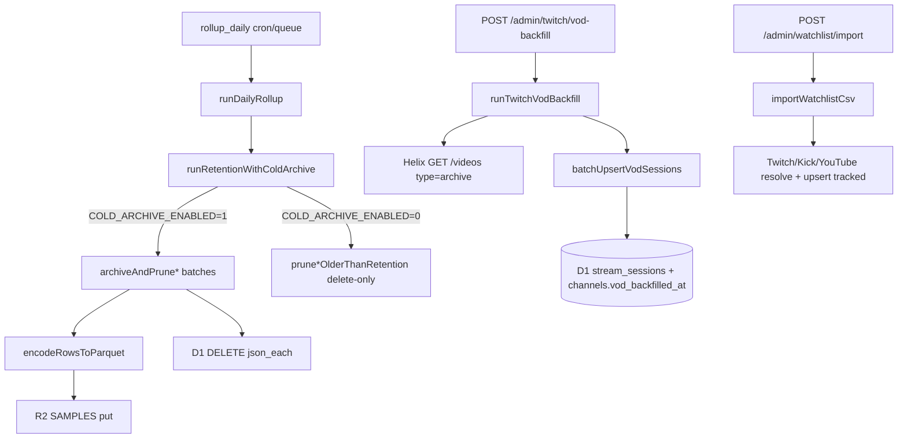

# Phase 3–4 review — Agent 3: Phase 4 ingest

**Date:** 2026-06-05  
**Agent:** Audit Agent 3 (Phase 4 ingest)  
**Scope:** 90d rollups, R2 Parquet cold archive, VOD backfill, watchlist import  
**Plan SSOT:** [28-phase4-plan](../28-phase4-plan.md) · [06-storage-and-rollup-design](../06-storage-and-rollup-design.md) · [23-paid-tier-zero-overage-playbook](../23-paid-tier-zero-overage-playbook.md)

---

## MCP / tooling used

| Source | Tool | Result |
|--------|------|--------|
| Cloudflare docs | `search_cloudflare_documentation` — R2 limits, D1 batch/delete, Queues consumer config | [R2 limits](https://developers.cloudflare.com/r2/platform/limits/), [D1 limits](https://developers.cloudflare.com/d1/platform/limits/), [Queues configure](https://developers.cloudflare.com/queues/configuration/configure-queues/) |
| Context7 | `resolve-library-id` (Twitch API) | **Quota exceeded** — used [Twitch Get Videos](https://dev.twitch.tv/docs/api/videos) + [Helix guide](https://dev.twitch.tv/docs/api/guide) via Exa instead |
| Exa | `web_search_exa` — R2 Workers Paid, Helix Videos | R2 Class A pricing/ops; Helix `first` max 100, ~500 VOD list cap, token-bucket 429 |
| GitNexus | `query` (repo: Stream Charts) — VOD / cold archive flows | `proc_82_runretentionwithcold`, `proc_147_admintwitchvodbackfi` |
| GitNexus | `impact` on `runRetentionWithColdArchive` | **LOW / 0 upstream** (index under-reports `runDailyRollup` caller; grep confirms wire-up) |
| user-radar-sql | — | **Not used** — no D1 binding in MCP workspace; schema checked via `verify-d1-schema.ts` + migration file |
| Local verify | `bun run scripts/verify/verify-d1-schema.ts` | **PASS** (local, 0001–0010) |

---

## Plan alignment (Phase 4 ingest slices)

| Slice | Plan requirement | Implementation | Status |
|-------|------------------|----------------|--------|
| **4.2** | 90d hot rollups in D1 | `DAILY_ROLLUP_RETENTION_DAYS = 90` in [`prune-rollups.ts`](../../workers/ingest/src/db/prune-rollups.ts); invoked from `runRetentionWithColdArchive` / `rollup_daily` | **Met** |
| **4.3** | Parquet cold archive before prune; default off | [`r2/cold-archive.ts`](../../workers/ingest/src/r2/cold-archive.ts) + [`db/cold-archive.ts`](../../workers/ingest/src/db/cold-archive.ts); hive paths per [28-phase4-plan](../28-phase4-plan.md#slice-43--r2-parquet-cold-archive-shipped-2026-06-05) | **Met** |
| **4.5** | Admin CSV watchlist import | [`watchlist/import.ts`](../../workers/ingest/src/watchlist/import.ts) → `POST /admin/watchlist/import` | **Met** |
| **4.6** | Twitch VOD metadata backfill | [`twitch/vod-backfill.ts`](../../workers/ingest/src/twitch/vod-backfill.ts), migration **0010**, queue `vod_backfill_twitch` | **Met** |

Post-remediation baseline: [phase4-remediation](./phase4-remediation.md) closed P0-01–04, P1-01–10 (2026-06-05). This audit adds **operational / enablement** findings only.

---

## Verification: `COLD_ARCHIVE_ENABLED=0` vs doc 23

| Location | Value | Notes |
|----------|-------|-------|
| [`workers/ingest/wrangler.jsonc`](../../workers/ingest/wrangler.jsonc) root `vars` | `"0"` | L36 |
| `env.staging.vars` | `"0"` | L86 |
| `env.production.vars` | `"0"` | L107 |
| [28-phase4-plan](../28-phase4-plan.md) §4.3 | default **0** | Explicit |
| [11-cloudflare-deployment](../11-cloudflare-deployment.md) §R2 | prod default **0** | L119 |
| [23-paid-tier](../23-paid-tier-zero-overage-playbook.md) §4 knobs table | documents `SAMPLE_ARCHIVE_ENABLED=0` only | **Gap:** `COLD_ARCHIVE_ENABLED` not listed; §2 L257 still says “Parquet encode **deferred**” while Phase 4.3 shipped opt-in Parquet on prune |

**Verdict:** Runtime default **matches** plan and wrangler (production-safe). Doc 23 should add `COLD_ARCHIVE_ENABLED=0` beside `SAMPLE_ARCHIVE_ENABLED` and update §2 deferral wording (P2 doc drift).

---

## Verification: migration 0010 vs `verify-d1-schema.ts`

**Migration** [`migrations/d1/0010_twitch_vod_metadata.sql`](../../migrations/d1/0010_twitch_vod_metadata.sql):

```sql
ALTER TABLE channels ADD COLUMN vod_backfilled_at TEXT;
ALTER TABLE stream_sessions ADD COLUMN backfill_source TEXT;
ALTER TABLE stream_sessions ADD COLUMN duration TEXT;
ALTER TABLE stream_sessions ADD COLUMN view_count INTEGER;
CREATE INDEX idx_channels_vod_backfill ON channels(platform_id, ingest_state, vod_backfilled_at);
```

**Verifier** [`scripts/verify/verify-d1-schema.ts`](../../scripts/verify/verify-d1-schema.ts):

| Check | Expected | Migration |
|-------|----------|-----------|
| `channels.vod_backfilled_at` | ✓ L53 | 0010 L3 |
| `stream_sessions.backfill_source` | ✓ L55 | 0010 L5 |
| `stream_sessions.duration` | ✓ L55 | 0010 L6 |
| `stream_sessions.view_count` | ✓ L55 | 0010 L7 |
| `idx_channels_vod_backfill` | ✓ L64 | 0010 L9 |
| Migration file in `MIGRATION_FILES` | ✓ L23 | — |

**Local run (2026-06-05):** `PASS — 11 tables, key columns through 0010, 4 indexes through 0010 (local)`

---

## Architecture trace (GitNexus + code)



**Hot windows** ([06-storage](../06-storage-and-rollup-design.md)): samples **14d**, rollups **90d**. Cold path is **offline DuckDB** — not Workers read path ([11-cloudflare](../11-cloudflare-deployment.md) §R2).

---

## Findings

### P0 — none

No new production-breaking defects in Phase 4 ingest paths. Prior P0 items (schema verify 0010, cold-archive batch delete, watchlist coverage) remain closed per [phase4-remediation](./phase4-remediation.md).

### P1 — should fix before enabling cold archive in prod

| ID | Area | Issue | Evidence | Recommendation |
|----|------|-------|----------|----------------|
| **P1-01** | R2 cold / ops | **No bounded backlog drain** when `COLD_ARCHIVE_ENABLED=1`: `archiveAndPrune*` loops until all rows older than cutoff are gone in one `rollup_daily` invocation | [`db/cold-archive.ts`](../../workers/ingest/src/db/cold-archive.ts) L55–67, L107–123; prod `limits.cpu_ms: 30000` in [`wrangler.jsonc`](../../workers/ingest/wrangler.jsonc) L94–95 | Cap rows archived per rollup run (e.g. N batches × 500); resume next day. Model first-enable Class A puts ([R2 pricing](https://developers.cloudflare.com/r2/pricing/)) |
| **P1-02** | Docs / ops | **`COLD_ARCHIVE_ENABLED` absent from doc 23 knobs table**; §2 still says Parquet “deferred” | [23-paid-tier](../23-paid-tier-zero-overage-playbook.md) §4 L291–292 vs [28-phase4-plan](../28-phase4-plan.md) §4.3 | Add row: `COLD_ARCHIVE_ENABLED=0` prod; enable only after 14d hot prune stable + Class A model; distinguish from `SAMPLE_ARCHIVE_ENABLED` (live NDJSON) |

### P2 — suggestions

| ID | Area | Issue | Evidence | Recommendation |
|----|------|-------|----------|----------------|
| **P2-01** | R2 Parquet | **`codec: 'UNCOMPRESSED'`** inflates storage and put payload vs Snappy/GZIP | [`r2/cold-archive.ts`](../../workers/ingest/src/r2/cold-archive.ts) L115–123 | Switch to compressed codec when hyparquet-writer supports; remeasure object sizes |
| **P2-02** | R2 samples | **Mixed-platform batches** use first row for `partitionDate` / `platform` | [`r2/cold-archive.ts`](../../workers/ingest/src/r2/cold-archive.ts) L93–107; fetch orders by `id` not platform | Group by `(platform_id, date)` before put, or partition fetch per platform |
| **P2-03** | R2 integrity | **Delete-after-archive without checking put result**; R2 throw aborts delete (good), but no test for put failure | [`db/cold-archive.ts`](../../workers/ingest/src/db/cold-archive.ts) L59–64 | Add test: mocked `bucket.put` reject → rows remain in D1 |
| **P2-04** | R2 integrity | **Archive succeeds, delete fails** → duplicate Parquet parts on retry (same D1 rows) | Same flow | Optional: idempotent keys (hash batch) or mark archived rowids before delete |
| **P2-05** | VOD | **Cursor advanced even when zero in-window VODs** — channel won't retry until `VOD_BACKFILL_STALE_DAYS` (7d) | [`vod-backfill.ts`](../../workers/ingest/src/twitch/vod-backfill.ts) L95–107 | Document as intentional; or only mark when Helix returned ≥1 page |
| **P2-06** | VOD | **Metadata-only** — no HW rollup from VOD duration × views (doc 05 allows approximate HW) | [05-ingestion](../05-ingestion-per-platform.md) L122–124 vs implementation | Keep metadata-only for honesty; disclose in channel UI if VOD sessions shown |
| **P2-07** | VOD / Helix | **`maxPages=20` × `first=100`** per channel; Twitch list ~**500 VOD cap** per user | [Twitch Videos API](https://dev.twitch.tv/docs/api/videos); [`vod-backfill.ts`](../../workers/ingest/src/twitch/vod-backfill.ts) L53–54 | Acceptable; log when pagination hits cap |
| **P2-08** | Watchlist | **Sequential per-row Helix/Kick/YouTube calls** — large CSV slow; no client-side rate budget | [`watchlist/import.ts`](../../workers/ingest/src/watchlist/import.ts) L213–234 | Batch Twitch logins (Helix 100); document max rows per upload |
| **P2-09** | Tooling | GitNexus `impact(runRetentionWithColdArchive)` → 0 callers | MCP result vs grep [`daily-job.ts`](../../workers/ingest/src/rollup/daily-job.ts) L254 | Re-run `npx gitnexus analyze` after ingest changes |
| **P2-10** | Observability | `runDailyRollup` return includes only `viewerSamplesPruned`, not rollup prune counts | [`daily-job.ts`](../../workers/ingest/src/rollup/daily-job.ts) L256–261 | Extend return type or log channel/game prune stats |

---

## R2-specific risks

| Risk | Severity | Detail |
|------|----------|--------|
| **Class A burst on enable** | P1 | Each prune batch → one `PutObject` ([R2 Class A](https://developers.cloudflare.com/r2/pricing/)). First production enable after backlog could issue thousands of puts in one cron window. |
| **CPU / Error 1102** | P1 | Parquet encode + D1 fetch/delete loops share prod **30s CPU** budget ([Workers limits](https://developers.cloudflare.com/workers/platform/limits/)). |
| **Storage growth (UNCOMPRESSED)** | P2 | Parquet without compression; plus duplicate parts if delete fails post-put. |
| **Concurrent write 429** | Low | Keys use `part-{uuid}.parquet` — avoids same-key contention ([R2 limits](https://developers.cloudflare.com/r2/platform/limits/) footnote 5). |
| **Wrong NDJSON vs Parquet path** | Low | Live poll uses `.ndjson` ([`sample-archive.ts`](../../workers/ingest/src/r2/sample-archive.ts)); cold uses `.parquet` — orthogonal switches. |
| **Misconfig detection** | Ops | Doc 23 §5: nonzero R2 Class A with archives off → check both `SAMPLE_ARCHIVE_ENABLED` **and** `COLD_ARCHIVE_ENABLED`. |

**D1 batching:** Delete batches of **500** align with D1 guidance to chunk large deletes ([D1 limits](https://developers.cloudflare.com/d1/platform/limits/) — “run in batches”). `json_each` deletes respect per-statement limits.

**Queues (VOD):** Consumer `max_batch_size` 5 (root) / 3 (prod), `max_retries` 2–3, DLQ configured — within [Queues config](https://developers.cloudflare.com/queues/configuration/configure-queues/) defaults.

---

## VOD-specific risks

| Risk | Severity | Detail |
|------|----------|--------|
| **Helix rate budget** | P2 (if cron on) | Default `VOD_BACKFILL_MAX_CHANNELS_PER_RUN=25`; up to 20 pages × 1 point each ≈ 500 points/run. `VOD_BACKFILL_ON_DISCOVER=0` default — manual/queue only. |
| **Tier retention mismatch** | Low | 7 / 14 / 60d filter in [`vod-retention.ts`](../../workers/ingest/src/twitch/vod-retention.ts) matches [05-ingestion](../05-ingestion-per-platform.md) + plan §4.6. |
| **Live session overwrite** | Low | Upsert guard: `WHERE backfill_source IS NULL OR backfill_source = 'vod'` ([`vod-sessions.ts`](../../workers/ingest/src/db/vod-sessions.ts) L103). |
| **Partial run** | Low | Channel-level loop; failure before `markChannelsVodBackfilled` leaves cursor stale for unprocessed channels only. |
| **No rollup backfill** | P2 | VOD sessions stored for context; rankings still rollup-only from live samples — honest per historical-backfill table (doc 05). |
| **API list cap ~500** | P2 | Helix may not return full career history; aligns with Twitch VOD retention policy ([Twitch VOD help](https://help.twitch.tv/s/article/video-on-demand)). |

---

## Test coverage (ingest)

| Area | Spec files | In `vitest.unit.config.mts` | Notes |
|------|------------|------------------------------|-------|
| R2 Parquet encode/put | `test/cold-archive.spec.ts` | ✓ L43 | PAR1 magic, hive keys, skip reasons |
| Retention + archive order | `test/cold-archive-retention.spec.ts` | ✓ L44 | Archive-before-delete when enabled; delete-only when disabled |
| VOD retention math | `test/vod-retention.spec.ts` | ✓ L130 | Tier windows |
| VOD backfill job | `test/vod-backfill.spec.ts` | ✓ L131 | Pagination, retention filter, NEEDS_API |
| Helix /videos | `test/helix-videos.spec.ts` | ✓ L133 | Client parsing |
| D1 VOD sessions | `test/db-vod-sessions.spec.ts` | ✓ L134 | Upsert + `vod_backfilled_at` |
| VOD admin route | `test/vod-admin-routes.spec.ts` | ✓ L132 | Auth + handler |
| Watchlist CSV | `test/watchlist-csv-parse.spec.ts` | ✓ L126 | Parse errors |
| Watchlist import | `test/watchlist-import.spec.ts` | ✓ L127 | Row outcomes |
| Watchlist admin | `test/watchlist-admin-routes.spec.ts` | ✓ L128 | Real import path |
| Watchlist upsert | `test/watchlist-upsert.spec.ts` | ✓ L129 | promote/imported |

Coverage gate includes `src/r2/**` and `src/watchlist/**` ([phase4-remediation](./phase4-remediation.md) P0-04).

**Gap:** no test for R2 `put` rejection blocking D1 delete (P2-03).

---

## Summary counts

| Severity | Count | Notes |
|----------|-------|-------|
| **P0** | **0** | Ingest Phase 4 paths ship-ready at default flags |
| **P1** | **2** | Cold-archive enablement bounds; doc 23 knob gap |
| **P2** | **10** | Parquet compression, partitioning, tests, VOD/watchlist polish, tooling |

### R2 / VOD risk headline

- **R2:** Safe at **`COLD_ARCHIVE_ENABLED=0`** (prod default). Enabling without per-run caps risks **CPU timeout + Class A spike** on first backlog drain.
- **VOD:** **Metadata-only**, tier-filtered, live-session-safe upserts. Default cron off; Helix budget manageable at 25 channels/run.

---

## References

- [28-phase4-plan](../28-phase4-plan.md) — slices 4.2–4.6
- [06-storage-and-rollup-design](../06-storage-and-rollup-design.md) — 14d / 90d hot windows, 0010 schema
- [23-paid-tier-zero-overage-playbook](../23-paid-tier-zero-overage-playbook.md) — `SAMPLE_ARCHIVE_ENABLED`, R2 Class A gates
- [11-cloudflare-deployment](../11-cloudflare-deployment.md) — R2 patterns, local cold-archive dev steps
- [phase4-remediation](./phase4-remediation.md) — closed P0/P1 code fixes
- [phase4-signoff](./phase4-signoff.md) — Phase 4 complete; cold archive opt-in deferral
- Cloudflare: [R2 limits](https://developers.cloudflare.com/r2/platform/limits/), [R2 pricing](https://developers.cloudflare.com/r2/pricing/), [D1 limits](https://developers.cloudflare.com/d1/platform/limits/)
- Twitch: [Get Videos](https://dev.twitch.tv/docs/api/videos), [Rate limits](https://dev.twitch.tv/docs/api/guide#twitch-rate-limits)
